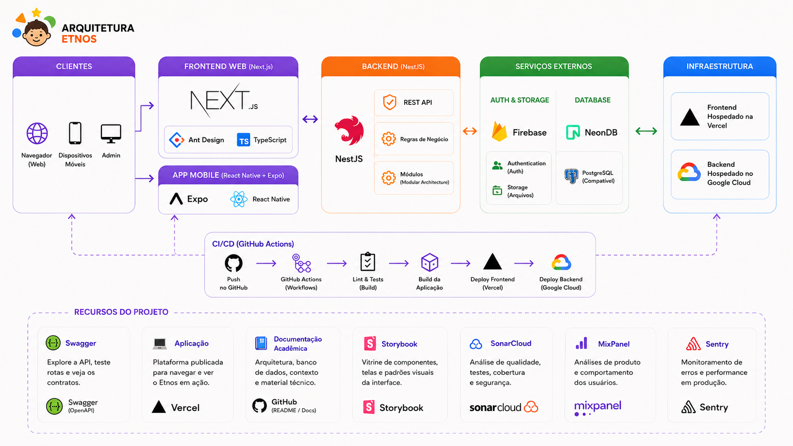

# Etnos

Plataforma educacional com jogos culturais para estudantes do ensino
fundamental, organizada em monorepo com apps web/mobile, API e pacotes
compartilhados.

[](./CHANGELOG.md)


## Visão geral do monorepo

### Apps

- `apps/web`: site institucional, login e cadastro.
- `apps/student`: portal web do estudante com jogos, dashboard e perfil.
- `apps/student-mobile`: app nativo Expo (iOS, Android e Web).
- `apps/admin`: painel administrativo para conteúdo, escolas e operação.
- `apps/api`: API NestJS com Prisma, Firebase e Swagger.
- `apps/games`: biblioteca React de jogos reutilizáveis.
- `apps/docs`: Storybook dos componentes visuais.

### Packages

- `packages/services`: clientes HTTP e serviços de domínio (auth, jogos, escolas, mídia).
- `packages/core`: cliente HTTP e serviços compartilhados para o mobile.
- `packages/tools`: hooks React Query e helpers para apps web.
- `packages/ui`: biblioteca de componentes e estilos compartilhados.
- `packages/types`: contratos e entidades compartilhadas.
- `packages/analytics`: integração Mixpanel (web e mobile).
- `packages/performance`: testes de carga com k6 e stack local Grafana/Prometheus.
- `packages/tailwind-config`: estilos e config comum de Tailwind/PostCSS.
- `packages/typescript-config`: presets de `tsconfig` do monorepo.
- `packages/eslint-config`: presets de lint reutilizáveis.

### Docs

- `docs-site`: documentação técnica (MkDocs → GitHub Pages).
- `AGENTS.md`: convenções para agentes (analytics, eventos Mixpanel).
- `RELEASE.md`: versionamento com semantic-release.

## Funcionalidades atuais

- **guess-game** (Adivinhe): dicas, tentativas por letra ou palavra inteira, teclado
  nas caixinhas, validação no backend, score e NPS.
- **memory-game**: jogo da memória por personagem, níveis de dificuldade, capa,
  cartas configuráveis e recorde.
- **dashboard do estudante**: resumo de progresso e atividades recentes na home.
- **dashboard de performance (admin)**: métricas de uso, NPS e ranking.
- **onboarding pós-login** com vínculo do estudante à escola.
- **cadastro simplificado** por link/código da escola.
- **histórico de atividades** e pontuações por jogo/personagem.
- **notificações push** no app mobile e envio pelo painel admin.
- **avaliação (NPS)** após partidas nos jogos web.
- **analytics Mixpanel** em web, student, admin e mobile.

## Stack principal

- Frontend web: Next.js 16, React 19, Tailwind CSS e Ant Design.
- Mobile: React Native, Expo, Expo Router e React Query.
- Backend: NestJS, Prisma, PostgreSQL, Firebase Auth/Storage e Sentry.
- Monorepo: Yarn Workspaces e Turborepo.
- Testes: Vitest e Testing Library (apps e pacotes); Jest na API.



## Requisitos

- Node.js >= 18 (recomendado LTS 20+)
- Yarn >= 1.22.19

## Primeiros passos

```bash
git clone https://github.com/joaojuniorbr/etnos.git
cd etnos
yarn install
```

Configure os arquivos de ambiente:

- apps Next (`apps/web`, `apps/admin`, `apps/student`): `.env.local` **dentro de cada app** (não basta na raiz do monorepo)
- API (`apps/api`): `.env`
- mobile (`apps/student-mobile`): `.env`

Variáveis de pacotes compartilhados (ex.: Mixpanel em `@etnos/analytics`) usam `NEXT_PUBLIC_*` no `.env.local` do app Next que você está rodando; o token é repassado pelo `AppProviders`.

Exemplo frontend:

```env
NEXT_PUBLIC_API_URL=http://localhost:8080/api
NEXT_PUBLIC_MIXPANEL_TOKEN=your_mixpanel_project_token
NEXT_PUBLIC_FIREBASE_API_KEY=your_key
NEXT_PUBLIC_FIREBASE_PROJECT_ID=your_project
```

Mobile (`apps/student-mobile/.env`):

```env
EXPO_PUBLIC_API_URL=http://localhost:8080/api
EXPO_PUBLIC_MIXPANEL_TOKEN=your_mixpanel_project_token
```

Modelos completos: `.env.example` na raiz e em cada app (`apps/web/.env.example`, etc.).

Exemplo API:

```env
NODE_ENV=development
PORT=8080
DATABASE_URL=postgres://...
DIRECT_URL=postgres://...
FIREBASE_PROJECT_ID=your_project
FIREBASE_PRIVATE_KEY=your_private_key
FIREBASE_CLIENT_EMAIL=your_email
```

## Desenvolvimento

Subir todo o monorepo:

```bash
yarn dev
```

Endpoints locais principais:

- `http://localhost:3000`: web
- `http://localhost:3001`: admin
- `http://localhost:3002`: student
- `http://localhost:8080/api`: API (porta padrão; Swagger em `/docs`)
- `http://localhost:6006`: Storybook

Mobile:

```bash
yarn workspace @etnos/student-mobile dev
```

Documentação MkDocs (local):

```bash
cd docs-site && mkdocs serve
```

## Scripts úteis

```bash
yarn dev              # sobe apps em paralelo (Turborepo)
yarn build            # build de todos os workspaces
yarn lint             # ESLint
yarn test             # Vitest/Jest conforme o workspace
yarn check-types      # tsc --noEmit
yarn format           # Prettier
yarn commit           # commit no padrão conventional (Commitizen)
yarn release          # semantic-release (CI na main)
yarn sonar            # análise SonarCloud local
```

## Fluxo de jogos (resumo)

1. estudante acessa um jogo no `apps/student` ou `apps/student-mobile` (memória);
2. renderização vem de `@etnos/games` (web) e integrações de `@etnos/tools` / `@etnos/services`;
3. API (`apps/api`) valida tentativas, retorna conteúdo e persiste score/histórico/NPS;
4. `apps/admin` mantém conteúdo, capas, mídias e habilitação por escola.

Detalhes: [arquitetura dos jogos](docs-site/docs/games-architecture.md).

## Documentação

- [Documentação técnica (MkDocs)](https://joaojuniorbr.github.io/etnos/) — arquitetura, banco, analytics, performance
- [Processo de release](./RELEASE.md)
- [Changelog](./CHANGELOG.md)

## Links

- [Swagger](https://api.etnos.online/docs)
- [Aplicação](https://etnos.online)
- [Storybook](https://691f7645d388cc8aa2a047b6-amyptzoyzk.chromatic.com/)
- [Sonar Cloud](https://sonarcloud.io/project/overview?id=joaojuniorbr_etnos)

## Licença

`UNLICENSED`
