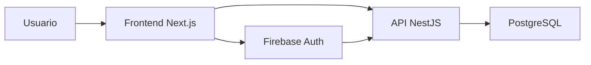
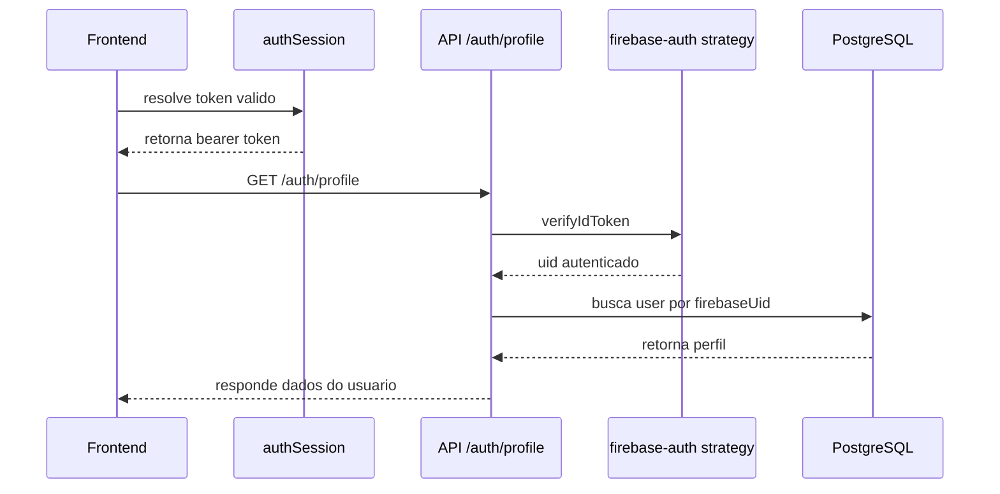

# Autenticacao e sessao

## Objetivo

Documentar como o Etnos autentica usuarios, protege rotas e mantem sessoes
ativas com seguranca no frontend e na API.

## Componentes envolvidos

- `Firebase Auth`: identidade, emissao de token e recuperacao de senha.
- `apps/api`: validacao do token e persistencia do perfil.
- `packages/tools/useAuth`: fluxo de login, cadastro, logout e perfil.
- `packages/tools/authSession`: armazenamento local, refresh e expiração por
  inatividade.
- `packages/ui/AuthProtected`: bloqueio de rotas autenticadas.

## Visao geral do fluxo

## Principios da arquitetura

### 1. Identidade separada de perfil

O Firebase e responsavel pela identidade tecnica do usuario. Ja o perfil de
negocio do Etnos fica no Postgres.

Na pratica:

- Firebase guarda credenciais e emite `idToken`;
- a API valida o token e usa `uid` como chave de integracao;
- o perfil do usuario e carregado da tabela `users`.

### 2. API como fronteira de negocio

O frontend nao fala diretamente com o banco. Mesmo em autenticacao, o cliente
nao decide regras de perfil nem persistencia do dominio.

### 3. Sessao controlada no frontend

O token e mantido no navegador e renovado quando esta perto de expirar, desde
que a sessao ainda esteja dentro da janela de atividade permitida.

## Fluxos principais

### Login com email e senha

1. o frontend envia email e senha para `POST /auth/login`;
2. a API delega a validacao ao endpoint do Firebase Identity Toolkit;
3. a API valida o `idToken` recebido;
4. a API busca o perfil pelo `firebaseUid`;
5. o frontend salva `idToken`, `refreshToken`, expiracao e ultima atividade no
   `localStorage`.

### Cadastro com email e senha

1. o frontend envia dados para `POST /auth/register`;
2. a API cria o usuario no Firebase;
3. a API cria o perfil no Postgres;
4. a API retorna a sessao autenticada;
5. o frontend persiste a sessao localmente.

### Login com Google

1. o frontend usa `signInWithPopup` do Firebase;
2. o token do Firebase e enviado para `POST /auth/google`;
3. a API valida o token;
4. se ainda nao existir perfil, a API cria um perfil base;
5. o frontend salva a sessao e passa a consultar `/auth/profile`.

### Recuperacao de senha

1. o frontend chama `POST /auth/recovery`;
2. a API usa o Firebase Identity Toolkit para disparar o email de reset.

## Fluxo de perfil autenticado

## Gestao de sessao no frontend

Os dados de sessao sao armazenados em chaves locais:

- `etnos_auth_token`
- `etnos_auth_refresh_token`
- `etnos_auth_expires_at`
- `etnos_auth_last_activity_at`

### Regras principais

- toda request autenticada passa por um interceptor Axios;
- antes da request, o frontend tenta resolver um token valido;
- se o token estiver perto da expiracao, ocorre refresh automatico;
- se a sessao exceder o limite de inatividade, os dados locais sao limpos.

### Inatividade

O limite atual de inatividade e de **8 dias**. A atividade do usuario e
atualizada em eventos como:

- `pointerdown`
- `keydown`
- `scroll`
- `visibilitychange`

## Protecao de rotas

`student` e `admin` usam `AuthProtected`, que:

- espera o carregamento do perfil;
- redireciona para `/login` quando nao existe usuario autenticado;
- renderiza loading enquanto a consulta de perfil esta em andamento.

## Responsabilidades por camada

### Frontend

- iniciar login ou cadastro;
- salvar e renovar sessao;
- enviar bearer token nas requests;
- bloquear rotas autenticadas;
- editar perfil com `POST /auth/profile`.

### API

- validar token com `passport-firebase-jwt`;
- mapear `uid` para perfil no banco;
- criar perfil inicial em cadastro e Google login;
- limitar atualizacao de perfil a campos permitidos.

### Banco

Na tabela `users`, o campo central da integracao e:

- `firebase_uid`

Esse campo conecta identidade do Firebase ao perfil do Etnos.

## Endpoints principais

- `POST /auth/login`
- `POST /auth/register`
- `POST /auth/google`
- `POST /auth/recovery`
- `GET /auth/profile`
- `POST /auth/profile`

## Variaveis relevantes

### Frontend

- `NEXT_PUBLIC_API_URL`
- `NEXT_PUBLIC_FIREBASE_API_KEY`
- `NEXT_PUBLIC_FIREBASE_AUTH_DOMAIN`
- `NEXT_PUBLIC_FIREBASE_PROJECT_ID`
- `NEXT_PUBLIC_FIREBASE_STORAGE_BUCKET`
- `NEXT_PUBLIC_FIREBASE_MESSAGING_SENDER_ID`
- `NEXT_PUBLIC_FIREBASE_APP_ID`
- `NEXT_PUBLIC_FIREBASE_MEASUREMENT_ID`

### API

- `FIREBASE_API_KEY`
- `FIREBASE_BASE64`
- `FIREBASE_STORAGE_BUCKET`

## Riscos e pontos de atencao

- qualquer problema no refresh do token pode causar logout aparente no frontend;
- divergencias entre usuario no Firebase e perfil no Postgres afetam o acesso;
- apps autenticados dependem do `GET /auth/profile` para consolidar a sessao;
- o frontend usa `localStorage`, entao a sessao e estritamente client-side.
