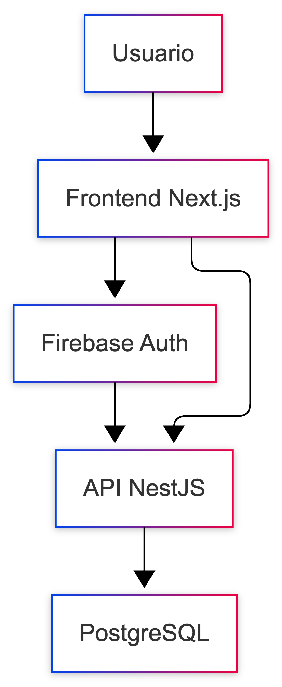
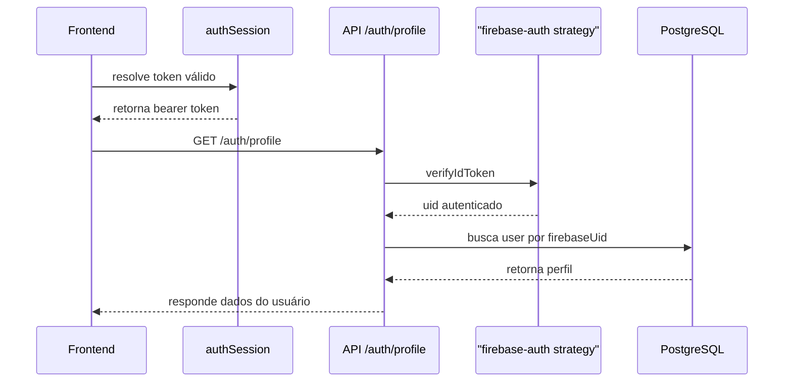
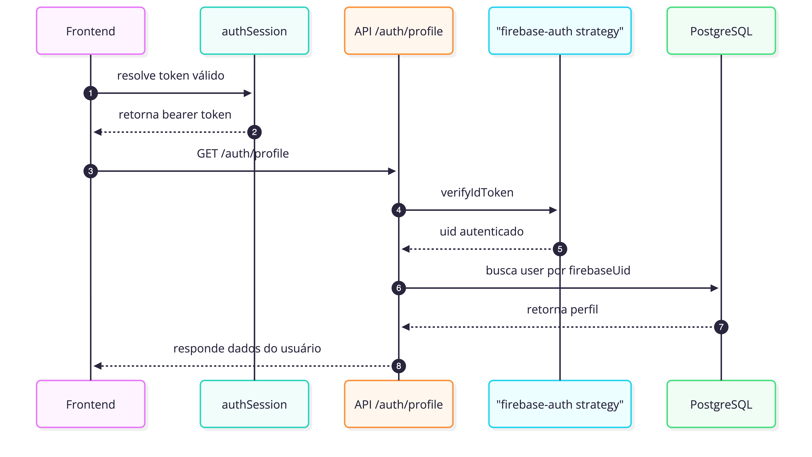

# Autenticação

## Visão geral

No Etnos, a autenticação acontece em duas frentes: o `Firebase Auth` cuida da
identidade do usuário, e a API cuida do perfil da plataforma. Em outras
palavras, o login nasce no Firebase, mas os dados de negócio vivem no Postgres.

As peças principais desse fluxo são:

- `Firebase Auth`, que faz login, cadastro, recuperação de senha e emissão de
  token;
- `apps/api`, que valida o token e busca o perfil do usuário;
- `packages/tools/useAuth`, que organiza login, cadastro, logout e perfil no
  frontend;
- `packages/tools/authSession`, que guarda a sessão local e faz o refresh do
  token;
- `packages/ui/AuthProtected`, que protege as áreas autenticadas.

## Como o fluxo funciona

O caminho é simples: o usuário entra pelo frontend, o Firebase confirma a
identidade, a API valida o token e o Postgres devolve o perfil completo.

## O que cada parte faz

### Identidade e perfil

O Firebase é responsável pela identidade técnica do usuário. Já o perfil do
Etnos fica salvo no Postgres.

Na prática:

- o Firebase guarda as credenciais e emite o `idToken`;
- a API valida esse token e usa o `uid` como chave de integração;
- o perfil é carregado a partir da tabela `users`.

### API como fronteira

O frontend não conversa direto com o banco. Toda regra de autenticação, perfil e
persistência passa pela API.

### Sessão no frontend

O token fica no navegador e é renovado quando está perto de expirar, desde que
a sessão ainda esteja dentro da janela de atividade permitida.

## Fluxos principais

### Login com e-mail e senha

1. o frontend envia e-mail e senha para `POST /auth/login`;
2. a API delega a validação ao endpoint do Firebase Identity Toolkit;
3. a API valida o `idToken` recebido;
4. a API busca o perfil pelo `firebaseUid`;
5. o frontend salva `idToken`, `refreshToken`, expiração e última atividade no
   `localStorage`.

### Cadastro com e-mail e senha

1. o frontend envia dados para `POST /auth/register`;
2. a API cria o usuário no Firebase;
3. a API cria o perfil no Postgres;
4. a API retorna a sessão autenticada;
5. o frontend persiste a sessão localmente.

### Login com Google

1. o frontend usa `signInWithPopup` do Firebase;
2. o token do Firebase e enviado para `POST /auth/google`;
3. a API valida o token;
4. se ainda não existir perfil, a API cria um perfil base;
5. o frontend salva a sessão e passa a consultar `/auth/profile`.

### Recuperação de senha

1. o frontend chama `POST /auth/recovery`;
2. a API usa o Firebase Identity Toolkit para disparar o e-mail de reset.

## Perfil autenticado

## Sessão no frontend

Os dados da sessão ficam nestas chaves locais:

- `etnos_auth_token`
- `etnos_auth_refresh_token`
- `etnos_auth_expires_at`
- `etnos_auth_last_activity_at`

### Regras principais

- toda requisição autenticada passa por um interceptor Axios;
- antes da requisição, o frontend tenta resolver um token válido;
- se o token estiver perto da expiração, acontece refresh automático;
- se a sessão passar do limite de inatividade, os dados locais são limpos.

### Inatividade

O limite atual de inatividade é de **8 dias**. A atividade do usuário é
atualizada em eventos como:

- `pointerdown`
- `keydown`
- `scroll`
- `visibilitychange`

## Proteção de rotas

`student` e `admin` usam `AuthProtected`, que:

- espera o carregamento do perfil;
- redireciona para `/login` quando não existe usuário autenticado;
- renderiza um loading enquanto a consulta de perfil está em andamento.

## Responsabilidades por camada

### Frontend

- iniciar login ou cadastro;
- salvar e renovar sessão;
- enviar bearer token nas requisições;
- bloquear rotas autenticadas;
- editar perfil com `POST /auth/profile`.

### API

- validar token com `passport-firebase-jwt`;
- mapear `uid` para perfil no banco;
- criar perfil inicial em cadastro e Google login;
- limitar atualização de perfil a campos permitidos.

### Banco

Na tabela `users`, o campo central da integração é:

- `firebase_uid`

É esse campo que conecta a identidade do Firebase ao perfil do Etnos.

## Endpoints principais

- `POST /auth/login`
- `POST /auth/register`
- `POST /auth/google`
- `POST /auth/recovery`
- `GET /auth/profile`
- `POST /auth/profile`

## Variaveis relevantes

### Frontend

- `NEXT_PUBLIC_API_URL`
- `NEXT_PUBLIC_FIREBASE_API_KEY`
- `NEXT_PUBLIC_FIREBASE_AUTH_DOMAIN`
- `NEXT_PUBLIC_FIREBASE_PROJECT_ID`
- `NEXT_PUBLIC_FIREBASE_STORAGE_BUCKET`
- `NEXT_PUBLIC_FIREBASE_MESSAGING_SENDER_ID`
- `NEXT_PUBLIC_FIREBASE_APP_ID`
- `NEXT_PUBLIC_FIREBASE_MEASUREMENT_ID`

### API

- `FIREBASE_API_KEY`
- `FIREBASE_BASE64`
- `FIREBASE_STORAGE_BUCKET`
