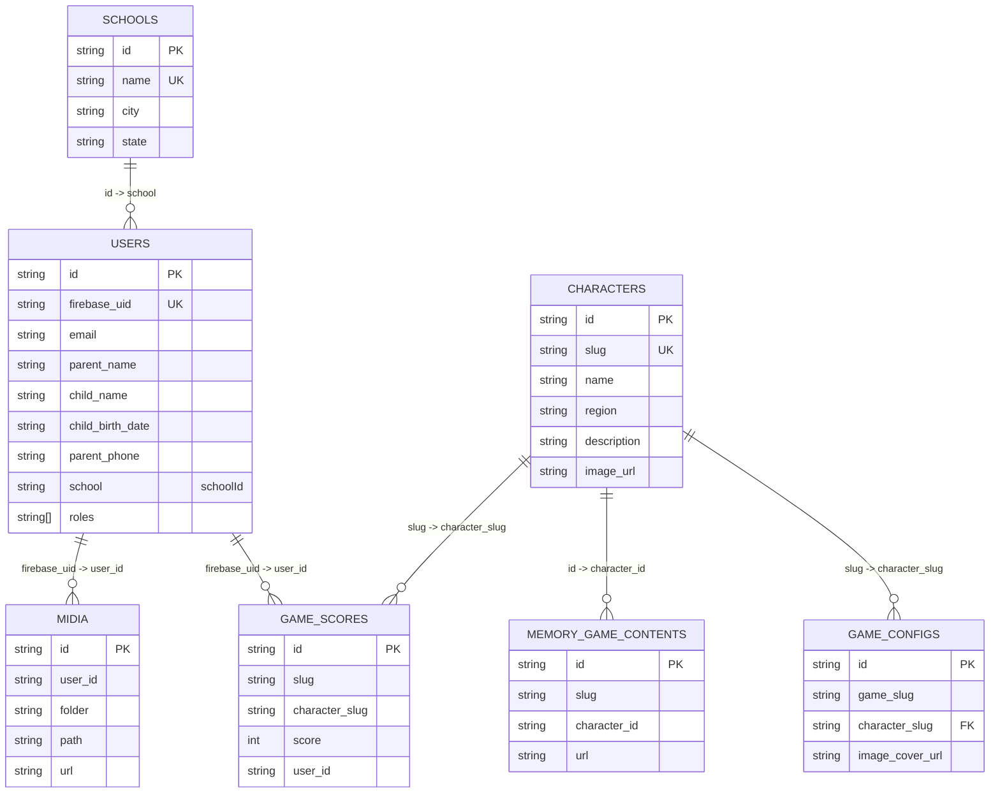
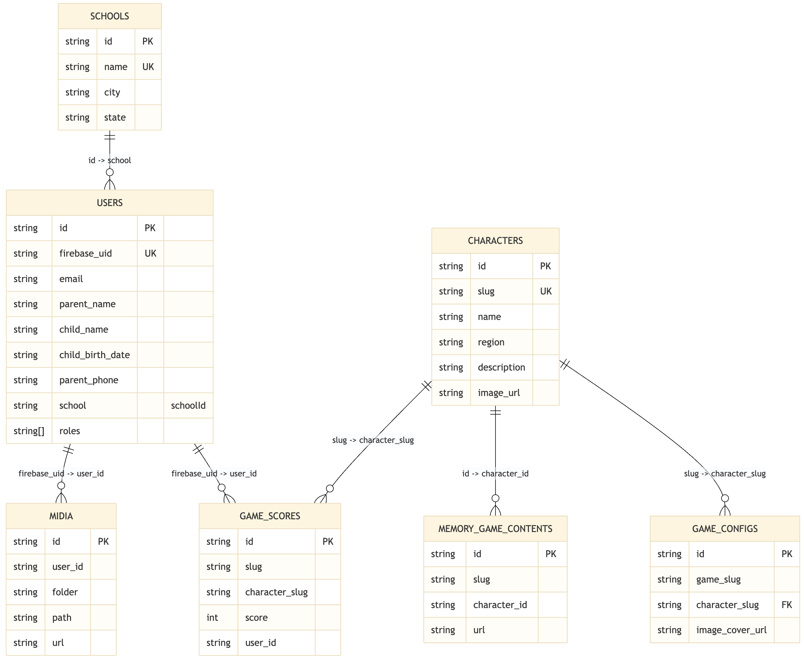

# Modelagem de Dados

## Visão geral

O banco principal da API é relacional e modelado em Prisma. Esta página mostra
como as tabelas se conectam e como o domínio do Etnos foi organizado no
Postgres.

## Arquivos relacionados

- [DDL PostgreSQL para DrawSQL](files/etnos-postgresql-ddl.sql)
- fonte de verdade do schema: `apps/api/prisma/schema.prisma`
- [Arquitetura de Banco de Dados](database-architecture.md)

## Resumo rápido

| Tabela                 | Finalidade                                   |
| ---------------------- | -------------------------------------------- |
| `users`                | Perfil de negócio vinculado ao Firebase Auth |
| `schools`              | Cadastro de escolas                          |
| `characters`           | Personagens culturais da plataforma          |
| `game_configs`         | Configuração por jogo e personagem           |
| `memory_game_contents` | Conteúdo visual do jogo da memória           |
| `game_scores`          | Pontuações por usuário                       |
| `midia`                | Metadados dos arquivos salvos no Storage     |

## Visão relacional

### Imagem da modelagem

### Mermaid

[URL Mermaid](https://mermaid.ai/live/edit#pako:eNqtVe-PmjAY_lfI-1kNgojyYYnhvDtz81xEP2xzIT2o0ASoKWXZzfN_XwvqyRUdS8Yn-v58-vZ52j0ENMTgAGZ3BEUMpZtME5_nPi4Wnz3t7a3bpXtt7U2XnuZoGyCh1v2k5UFMabKBKth9nCwn7kqGHOMfJvOp7y6e72cPVVqeFJFMDGLEUMAx86XleoH5dL5YfvVPdVbT59Vl__cyJPwLCs9dLKdtQFR7vJK6JQy_oBz7RQWgyGu9a7nz2d1s0j5rXy3kl3NGskgTwV-eFGut2Fr14xSRRLHuEMMZ9zOUYsUXxCQJb7leCOOxHyKOr9XdxTRTnRU95MTLn9l5x-8x339ojCY4r-yHOuvajkRCbxpFQPirCoqf93FQGNO2Y0mhdTMSxchwRGimmEOcB4zseJOPpCgSJ8ySGtCanNpCjQSkiuDq4V7yX7t_ugIjoD9FzEcwjdL8l_ndwCO08dHZOIujMv9T17qbZFwQmDL1PE_yrU2jFHtbILUKl9qmSYhZg8h4fGMg0IGIkRAczgrcgRQzcQWIJZRwNsBjLFgJ8iaSF4cUoczZoewbpekpjdEiisHZoiQXq2In5X58C85WoXWBz6VFxsHp2yO9rALOHn6BY1h2T9dts2-YI2s0HgzsDryC07WM3ti0dXNsj21DH9mjQwd-l4313nA4NI2B0bctkWlZZgdwSDhl8-o1Cmi2JREc_gCK1fv9)

## Tabelas

### `users`

Representa o perfil de negócio do usuário autenticado.

Campos principais:

- `id`: identificador interno
- `firebase_uid`: vínculo com o Firebase Auth
- `email`
- `parent_name`
- `child_name`
- `child_birth_date`
- `parent_phone`
- `school`
- `roles`
- `created_at`
- `updated_at`

Regras:

- `firebase_uid` é único
- o usuário autentica no Firebase, mas o perfil é salvo aqui

Na prática, o campo persistido hoje se chama `school`, mas ele representa o
`schoolId` e aponta para `schools.id`.

### `schools`

Cadastro de escolas disponíveis para uso na plataforma.

Campos principais:

- `id`
- `name`
- `city`
- `state`
- `created_at`
- `updated_at`

Regras:

- `name` é único no schema atual

- alimentar seletores de escola no cadastro e no perfil

### `characters`

Entidade principal para personagens culturais usados nos jogos e na biblioteca.

Campos principais:

- `id`
- `name`
- `region`
- `description`
- `slug`
- `image_url`
- `created_at`
- `updated_at`

Regras:

- `slug` é único

Uso típico:

- servir como catálogo principal da experiência cultural e base dos jogos

### `game_configs`

Configuração por jogo e personagem.

Campos principais:

- `id`
- `game_slug`
- `character_slug`
- `image_cover_url`
- `created_at`
- `updated_at`

Relações:

- `character_slug` referencia `characters.slug`

Regras:

- combinação `game_slug + character_slug` é única

Uso típico:

- guardar a capa e a configuração visual do `memory-game` para cada personagem

### `memory_game_contents`

Conteúdo visual usado no jogo da memória.

Campos principais:

- `id`
- `url`
- `slug`
- `character_id`
- `created_at`
- `updated_at`

Aqui, `character_id` referencia `characters.id`, e o campo `slug` continua
sendo usado nas consultas por personagem.

Uso típico:

- montar as cartas e imagens do jogo da memória por personagem

### `game_scores`

Pontuações salvas por usuário em cada jogo/personagem.

Campos principais:

- `id`
- `slug`
- `character_slug`
- `score`
- `user_id`
- `created_at`
- `updated_at`

Regras:

- combinação `slug + character_slug + user_id` é única

Aqui, `character_slug` referencia `characters.slug` e `user_id` referencia
`users.firebase_uid`.

Uso típico:

- recuperar o desempenho do estudante por jogo

### `midia`

Metadados dos arquivos enviados para o Firebase Storage.

Campos principais:

- `id`
- `url`
- `folder`
- `path`
- `user_id`
- `created_at`
- `updated_at`

Uso típico:

- organizar a biblioteca de imagens usada pelo admin e pelos jogos

Regras:

- índice por `user_id`
- índice por `folder`

Observação:

- o arquivo físico fica no Firebase Storage
- esta tabela guarda apenas metadados e vínculo com usuário
- `user_id` referencia `users.firebase_uid`
- também sustenta a listagem da biblioteca de mídia e a organização por pasta

## Resumo relacional

### Relações explícitas no Prisma

- `game_configs.character_slug -> characters.slug`

### Relações implícitas por convenção

- `users.school -> schools.id`
- `memory_game_contents.character_id -> characters.id`
- `game_scores.character_slug -> characters.slug`
- `game_scores.user_id -> users.firebase_uid`
- `midia.user_id -> users.firebase_uid`
- `users.firebase_uid <-> Firebase Auth uid`

## Observações de modelagem

### Relações ainda não formalizadas no banco

Alguns vínculos ainda carregam nomes herdados da estrutura anterior,
principalmente o campo `users.school`, que semanticamente funciona como
`schoolId`. Na documentação, essas relações aparecem do ponto de vista do
domínio, mesmo quando o nome físico da coluna ainda é legado.

## Índices e unicidade

### Chaves únicas

- `users.firebase_uid`
- `schools.name`
- `characters.slug`
- `game_configs(game_slug, character_slug)`
- `game_scores(slug, character_slug, user_id)`

### Índices auxiliares

- `memory_game_contents.slug`
- `game_scores.user_id`
- `midia.user_id`
- `midia.folder`

## Decisões importantes da modelagem

### Uso de `firebaseUid`

O `firebaseUid` é a chave de integração entre autenticação e domínio. Isso evita
duplicar responsabilidade de auth no banco relacional.

### Slugs como chave de domínio

`characters.slug` e `game_slug` aparecem bastante porque fazem parte do contrato
atual da API e simplificam consultas e URLs.

### Arquivos fora do banco

O banco não armazena binários. Apenas URLs, caminhos e metadados.
