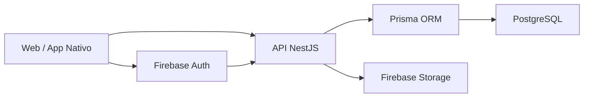

# Arquitetura de Banco de Dados

## Visão geral

No Etnos, a API concentra as regras de negócio e usa uma stack de dados bem
dividida:

- `Firebase Auth` para identidade;
- `Firebase Storage` para arquivos;
- `PostgreSQL` para os dados de domínio;
- `Prisma` para acessar o banco.

Fluxo principal:

`Cliente -> API NestJS -> Prisma -> PostgreSQL`

Fluxos auxiliares:

- autenticação: `Cliente -> Firebase Auth`
- autorização na API: `Firebase token -> firebase.strategy.ts`
- uploads: `API -> Firebase Storage`

## Diagrama da arquitetura



## Responsabilidades por tecnologia

| Tecnologia         | Papel na arquitetura                              |
| ------------------ | ------------------------------------------------- |
| `Firebase Auth`    | Login, identidade, emissão e validação de token   |
| `Firebase Storage` | Armazenamento de arquivos enviados pela aplicação |
| `PostgreSQL`       | Persistência principal dos dados de domínio       |
| `Prisma`           | ORM, schema tipado e acesso ao banco              |
| `NestJS API`       | Regras de negócio, validação e orquestração       |

### Firebase Auth

Cuida de:

- login com e-mail e senha
- login com Google
- recuperação de senha
- emissão e validação de `idToken`

O backend usa o `firebaseUid` como elo entre identidade e perfil.

### PostgreSQL

É onde ficam:

- perfis de usuário
- escolas
- personagens
- configurações de jogos
- conteúdo do jogo da memória
- pontuações
- metadados de mídia

### Prisma

É a camada que:

- mapear o schema relacional
- gerar o client tipado
- padronizar queries e updates
- manter a modelagem explícita no código

Arquivo principal do schema:

- `apps/api/prisma/schema.prisma`

## Como essa arquitetura foi organizada

### 1. Auth separado de perfil

O usuário autentica no Firebase, mas o perfil de negócio fica no Postgres. Com
isso, o mesmo backend atende web e app nativo, as regras ficam centralizadas no
servidor e o domínio continua desacoplado do SDK do banco no frontend.

### 2. Storage separado de metadados

Os arquivos continuam no Firebase Storage, mas os metadados ficam em `midia`.

Assim, a API consegue paginar, filtrar e relacionar arquivos com usuários sem
misturar tudo no bucket.

### 3. API como fonte de verdade

O frontend não deve conhecer detalhes do banco. Toda regra de acesso, validação
e persistência passa pela API.

## O que isso traz para o projeto

- backend mais consistente para web e app nativo
- regras de negócio centralizadas no servidor
- modelagem explícita e versionada com Prisma
- menor acoplamento do domínio ao SDK de banco do frontend

## Convenções adotadas

- nomes internos no Prisma em `camelCase`
- nomes de colunas com `@map(...)` em `snake_case`
- `createdAt` e `updatedAt` em todas as tabelas principais
- uso de índices e chaves únicas para regras de unicidade

## Relações importantes

- `users.school` funciona como referência para `schools.id`
- `users.firebase_uid` referencia a identidade do Firebase
- `memory_game_contents.character_id` aponta para `characters.id`
- `game_configs.character_slug` aponta para `characters.slug`
- `game_scores.character_slug` aponta para `characters.slug`
- `game_scores.user_id` e `midia.user_id` apontam para `users.firebase_uid`

## Operação do banco

Comandos mais usados no dia a dia:

```bash
yarn prisma:generate
yarn prisma:migrate:dev --name <nome-da-migration>
yarn prisma:migrate:deploy
```

## Documentos relacionados

- [Modelagem de Dados](data-model.md)
- [DDL PostgreSQL para DrawSQL](files/etnos-postgresql-ddl.sql)
