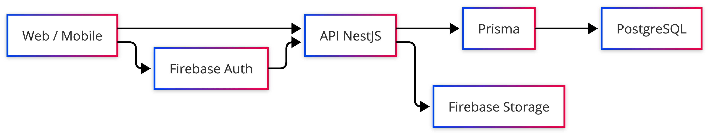

# Arquitetura de dados

## Visão geral

A API concentra regras de negócio e usa uma stack de dados dividida por
responsabilidade:

| Tecnologia           | Papel                          |
| -------------------- | ------------------------------ |
| **Firebase Auth**    | Identidade, login, tokens      |
| **Firebase Storage** | Arquivos (imagens, uploads)    |
| **PostgreSQL**       | Dados de domínio               |
| **Prisma**           | ORM, schema tipado, migrations |

Fluxo principal: `Cliente → API → Prisma → PostgreSQL`



## Princípios de organização

### Auth separado de perfil

O usuário autentica no Firebase; o perfil de negócio fica em `users` no Postgres,
ligado por `firebase_uid`. A mesma API atende web e mobile.

### Storage separado de metadados

Binários no Firebase Storage; metadados em `midia` para listagem, pastas e
vínculo com usuário.

### API como fonte de verdade

O frontend não acessa o banco diretamente. Validação, autorização por escola e
persistência passam pela API.

### Cache de leitura

O catálogo público de personagens (`GET /characters`) usa cache em memória na API
(TTL ~5 min), validado pelos [testes de performance](performance-tests.md).

## Domínios no Postgres

| Domínio                | Tabelas principais                                                          |
| ---------------------- | --------------------------------------------------------------------------- |
| Usuários e escolas     | `users`, `schools`, `school_accesses`                                       |
| Habilitação por escola | `school_enabled_games`, `school_enabled_characters`                         |
| Personagens e jogos    | `characters`, `game_configs`, `memory_game_contents`, `guess_game_contents` |
| Pontuação              | `game_scores`, `game_score_histories`                                       |
| Feedback               | `game_nps_responses`                                                        |
| Mídia                  | `midia`                                                                     |
| Notificações           | `user_push_tokens`, `notification_templates`, `notification_logs`           |

Detalhamento de colunas e relações: [Modelagem](data-model.md).

## Prisma

- schema: `apps/api/prisma/schema.prisma`
- migrations: `apps/api/prisma/migrations/`
- convenção: modelos em `camelCase`, colunas com `@map` em `snake_case`
- timestamps: `createdAt` / `updatedAt` nas entidades principais

### Comandos

```bash
cd apps/api
yarn prisma:generate
yarn prisma:migrate:dev --name <nome>
yarn prisma:migrate:deploy
```

## Relações centrais

- `users.school_id` → `schools.id` (relação formal no Prisma)
- `users.firebase_uid` ↔ Firebase Auth `uid`
- `school_enabled_characters.character_slug` → `characters.slug`
- `game_configs.character_slug` → `characters.slug`
- `game_scores.user_id` → `users.firebase_uid` (por convenção de domínio)
- `memory_game_contents.character_id` → `characters.id`
