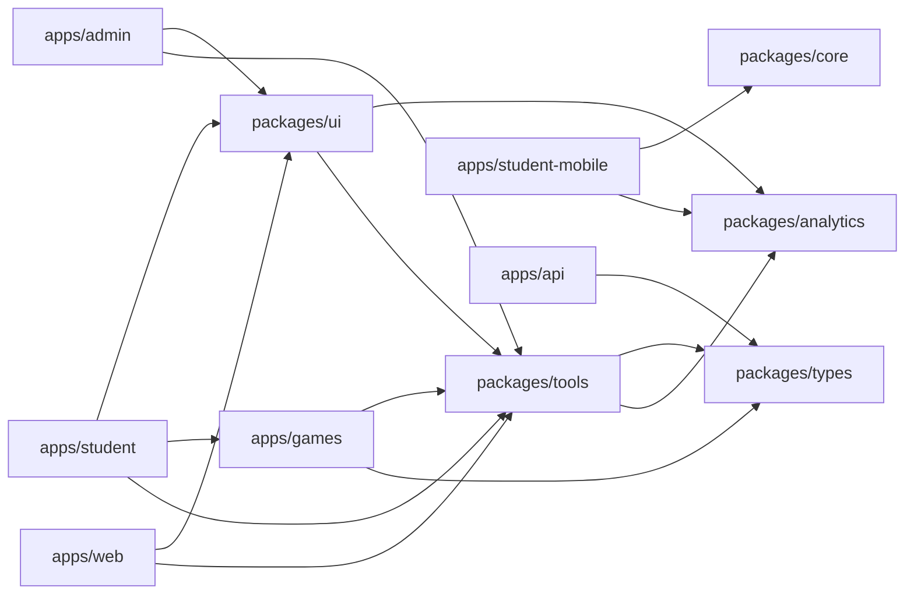
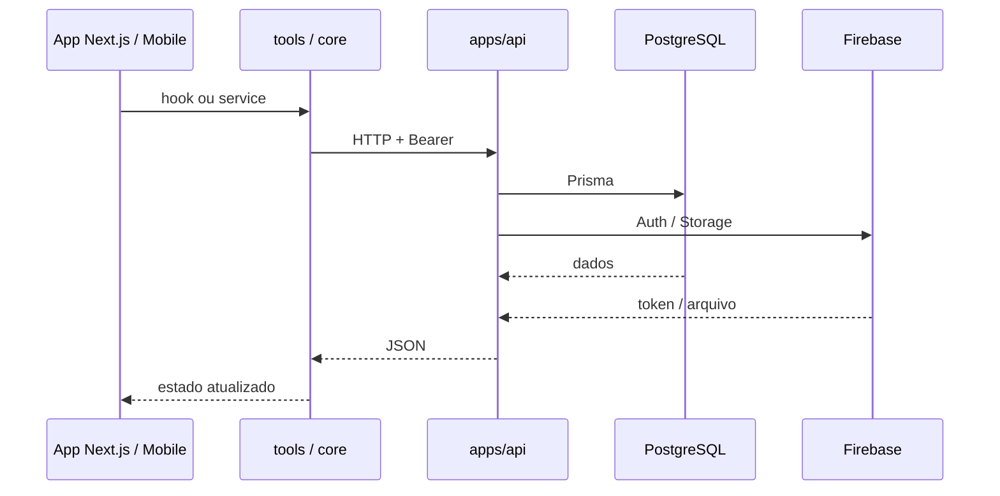
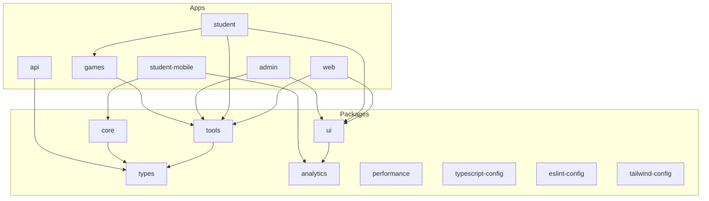
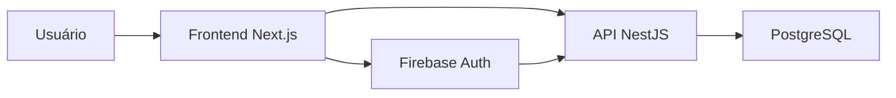
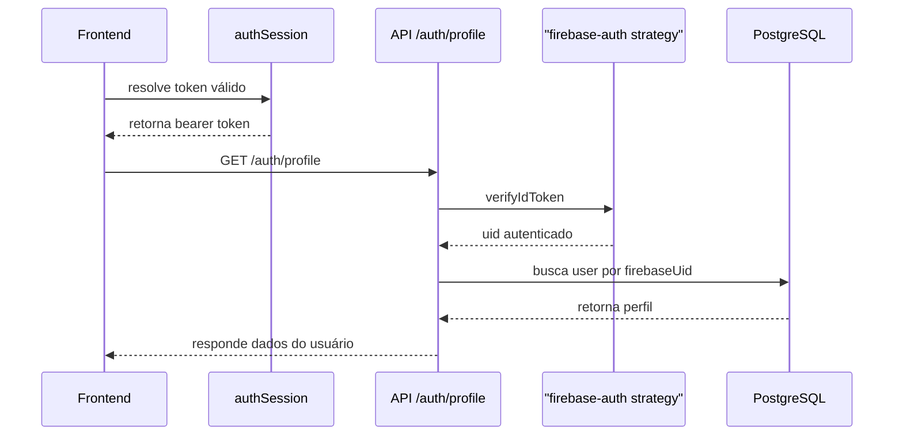
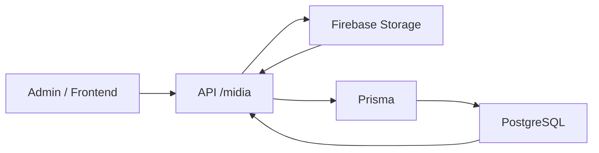
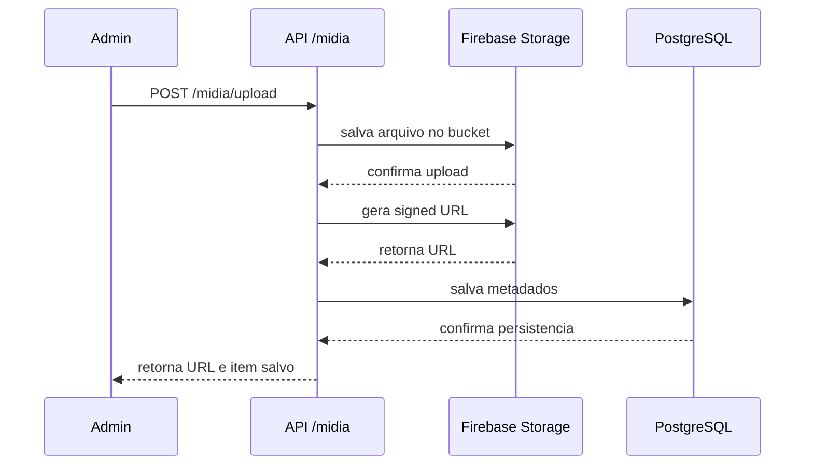
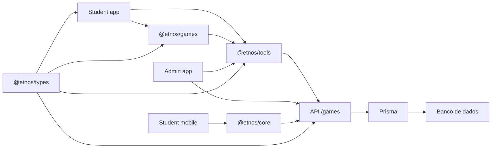
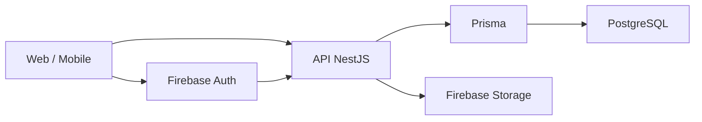

# Monorepo

```mermaid
flowchart LR
    A["apps/web"] --> U["packages/ui"]
    B["apps/student"] --> U
    B --> G["apps/games"]
    B --> T["packages/tools"]
    M["apps/student-mobile"] --> C0["packages/core"]
    M --> AN["packages/analytics"]
    C["apps/admin"] --> U
    C --> T
    D["apps/api"] --> Y["packages/types"]
    G --> T
    G --> Y
    T --> Y
    T --> AN
    U --> AN
    A --> T
    U --> T
```

## Fluxo entre camadas

```mermaid
sequenceDiagram
    participant UI as App Next.js / Mobile
    participant PKG as tools / core
    participant API as apps/api
    participant DB as PostgreSQL
    participant FS as Firebase

    UI->>PKG: hook ou service
    PKG->>API: HTTP + Bearer
    API->>DB: Prisma
    API->>FS: Auth / Storage
    DB-->>API: dados
    FS-->>API: token / arquivo
    API-->>PKG: JSON
    PKG-->>UI: estado atualizado
```

# Packages

```mermaid
flowchart TB
    subgraph apps [Apps]
        WEB[web]
        STU[student]
        ADM[admin]
        MOB[student-mobile]
        API[api]
        GAM[games]
    end
    subgraph packages [Packages]
        UI[ui]
        TOOLS[tools]
        CORE[core]
        TYPES[types]
        ANA[analytics]
        PERF[performance]
        TC[typescript-config]
        EC[eslint-config]
        TW[tailwind-config]
    end
    WEB --> UI
    STU --> UI
    ADM --> UI
    WEB --> TOOLS
    STU --> TOOLS
    ADM --> TOOLS
    MOB --> CORE
    STU --> GAM
    GAM --> TOOLS
    UI --> ANA
    MOB --> ANA
    TOOLS --> TYPES
    CORE --> TYPES
    API --> TYPES
```

# Autenticação

```mermaid
flowchart LR
    A["Usuário"] --> B["Frontend Next.js"]
    B --> C["Firebase Auth"]
    B --> D["API NestJS"]
    C --> D
    D --> E["PostgreSQL"]
```

## Perfil autenticado

```mermaid
sequenceDiagram
    participant UI as Frontend
    participant SESSION as authSession
    participant API as API /auth/profile
    participant FIREBASE as "firebase-auth strategy"
    participant DB as PostgreSQL

    UI->>SESSION: resolve token válido
    SESSION-->>UI: retorna bearer token
    UI->>API: GET /auth/profile
    API->>FIREBASE: verifyIdToken
    FIREBASE-->>API: uid autenticado
    API->>DB: busca user por firebaseUid
    DB-->>API: retorna perfil
    API-->>UI: responde dados do usuário
```

# MIDIA

```mermaid
flowchart LR
    A["Admin / Frontend"] --> B["API /midia"]
    B --> C["Firebase Storage"]
    B --> D["Prisma"]
    D --> E["PostgreSQL"]
    C --> B
    E --> B
```

# MIDIA Diagrama de sequencia

```mermaid
sequenceDiagram
    participant UI as Admin
    participant API as API /midia
    participant FS as Firebase Storage
    participant DB as PostgreSQL

    UI->>API: POST /midia/upload
    API->>FS: salva arquivo no bucket
    FS-->>API: confirma upload
    API->>FS: gera signed URL
    FS-->>API: retorna URL
    API->>DB: salva metadados
    DB-->>API: confirma persistencia
    API-->>UI: retorna URL e item salvo
```

# Games

```mermaid
flowchart LR
    A["Student app"] --> B["@etnos/games"]
    A --> C["@etnos/tools"]
    B --> C
    C --> D["API /games"]
    D --> E["Prisma"]
    E --> F["Banco de dados"]
    G["Admin app"] --> C
    G --> D
    M["Student mobile"] --> I["@etnos/core"]
    I --> D
    H["@etnos/types"] --> A
    H --> B
    H --> C
    H --> D
```

# Database

```mermaid
flowchart LR
    A["Web / Mobile"] --> B["API NestJS"]
    B --> C["Prisma"]
    C --> D["PostgreSQL"]
    A --> E["Firebase Auth"]
    E --> B
    B --> F["Firebase Storage"]
```
