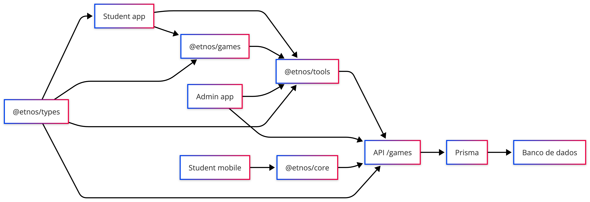

# Arquitetura dos jogos

## Visão geral

Os jogos do Etnos foram organizados para separar bem experiência visual, regras
do jogo, integração com API e persistência. Hoje essa parte passa por sete áreas
principais do monorepo:

- `apps/student`: entrega a experiência jogável para o estudante.
- `apps/admin`: permite configurar conteúdo e capas dos jogos.
- `apps/student-mobile`: app nativo que consome jogos e score.
- `apps/games`: biblioteca React com os jogos reutilizaveis.
- `apps/api`: expõe endpoints autenticados para configuração, conteúdo e score.
- `packages/tools`: hooks e services que conectam frontend e API.
- `packages/types`: enums e interfaces compartilhadas entre apps e pacotes.

## Fluxo geral

## Camadas e responsabilidades

### `apps/student`

O portal do estudante controla navegação, breadcrumb e contexto da experiência.
As paginas de jogos ficam em `app/jogos` e delegam a renderizacao para o
componente `Games`, que decide qual jogo da biblioteca deve ser exibido.

Responsabilidades principais:

- selecionar o tipo de jogo pela rota;
- recuperar o personagem via query string;
- renderizar o layout da experiência no contexto do estudante.

### `apps/games`

É a biblioteca compartilhada de jogos. Ela concentra a interface, os estados do
jogo e os componentes reutilizáveis, como placar e tela final.

Hoje a biblioteca exporta:

- `GuessGame`
- `MemoryGame`
- `FinishGame`
- `ScoreHighlight`
- `GameNpsModal`

Assim, o `student` consome um jogo pronto sem duplicar lógica de pontuação,
feedback visual ou integração com score.

### `packages/tools`

Faz a ponte entre UI e backend. Nessa camada ficam:

- hooks de consulta como `useGameScore`, `useGamesConfig` e
  `useMemoryGameContent`;
- services HTTP como `scoreGamesService`, `configGamesService` e
  `memoryGameContentService`;
- utilitários de experiência, incluindo listagem dos jogos e reprodução de sons.

### `apps/admin`

O painel administrativo cuida do lado editorial dos jogos. No caso do jogo da
memória, o admin consegue:

- definir a imagem de capa por personagem;
- selecionar as imagens que formam o baralho;
- remover itens de conteúdo cadastrados.

### `apps/api`

Centraliza as regras de persistência. A controller `games.controller.ts` oferece
endpoints para:

- configuração de capa por jogo e personagem;
- cadastro e remoção de conteúdo do jogo da memória;
- consulta e gravacao de pontuacoes;
- coleta de NPS ao final dos jogos com `POST /games/nps`;
- listagem de imagens formatadas para o frontend.

## Como o score funciona

O score do jogo da memória fica vinculado a três dimensões:

- jogo;
- personagem;
- usuário.

Na API, a gravação é feita com `upsert`, o que simplifica a atualização do
recorde do estudante sem criar duplicidade para a mesma combinação.

## Relação com o admin

O jogo da memória depende diretamente do painel administrativo:

- se o admin altera a capa, o verso das cartas muda no frontend;
- se o admin adiciona ou remove imagens, o conjunto de pares muda no jogo;
- sem conteúdo configurado para um personagem, o frontend fica sem cartas para
  montar a partida.

Essa separação deixa a curadoria do conteúdo no admin e a experiência jogável
no student, cada um no seu papel.

## Analytics de jogos

Eventos Mixpanel (via `@etnos/analytics`):

| Evento                   | Momento                                                       |
| ------------------------ | ------------------------------------------------------------- |
| `game_selected`          | Estudante escolhe o jogo                                      |
| `game_finished`          | Partida termina na UI (antes ou independente de salvar score) |
| `game_session_completed` | Backend persiste histórico (`game_score_histories`)           |

Propriedades típicas: `game_slug`, `game_name`, `character_slug`, `score`,
`outcome` (`won` / `lost` no Adivinhe). Detalhes em
[Analytics](analytics-architecture.md).

## Histórico de partidas

Além do recorde em `game_scores`, a API persiste cada sessão em
`game_score_histories` (`saveGameScoreHistory` em `useGames` na web e callback
equivalente no mobile). Isso alimenta relatórios no admin e o evento
`game_session_completed`.

## Habilitação por escola

Antes de jogar, o app consulta `GET /schools/me/game-access`. As tabelas
`school_enabled_games` e `school_enabled_characters` definem o que cada escola
pode acessar.

## Jogos da plataforma

Hoje a arquitetura cobre dois desafios:

- `guess-game` (Amotion) — conteúdo em `guess_game_contents`
- [`memory-game`](/etnos/games-architecture/memory-game) — conteúdo em `memory_game_contents` + `game_configs`
