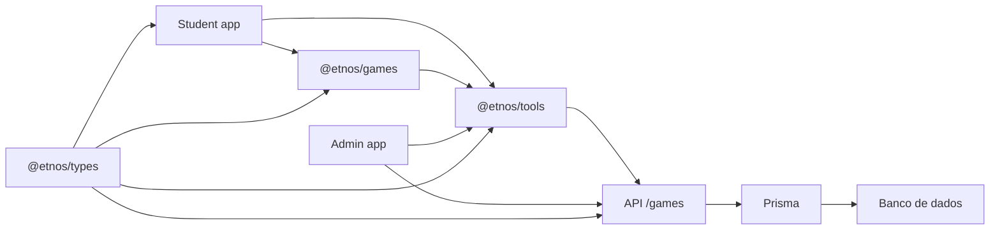

# Arquitetura dos jogos

## Visão geral

Os jogos do Etnos foram organizados para separar bem experiência visual, regras
do jogo, integração com API e persistência. Hoje essa parte passa por seis áreas
principais do monorepo:

- `apps/student`: entrega a experiência jogável para o estudante.
- `apps/admin`: permite configurar conteúdo e capas dos jogos.
- `apps/games`: biblioteca React com os jogos reutilizaveis.
- `apps/api`: expõe endpoints autenticados para configuração, conteúdo e score.
- `packages/tools`: hooks e services que conectam frontend e API.
- `packages/types`: enums e interfaces compartilhadas entre apps e pacotes.

## Fluxo geral

## Camadas e responsabilidades

### `apps/student`

O portal do estudante controla navegação, breadcrumb e contexto da experiência.
As paginas de jogos ficam em `app/jogos` e delegam a renderizacao para o
componente `Games`, que decide qual jogo da biblioteca deve ser exibido.

Responsabilidades principais:

- selecionar o tipo de jogo pela rota;
- recuperar o personagem via query string;
- renderizar o layout da experiência no contexto do estudante.

### `apps/games`

É a biblioteca compartilhada de jogos. Ela concentra a interface, os estados do
jogo e os componentes reutilizáveis, como placar e tela final.

Hoje a biblioteca exporta:

- `GuessGame`
- `MemoryGame`
- `FinishGame`
- `ScoreHighlight`

Assim, o `student` consome um jogo pronto sem duplicar lógica de pontuação,
feedback visual ou integração com score.

### `packages/tools`

Faz a ponte entre UI e backend. Nessa camada ficam:

- hooks de consulta como `useGameScore`, `useGamesConfig` e
  `useMemoryGameContent`;
- services HTTP como `scoreGamesService`, `configGamesService` e
  `memoryGameContentService`;
- utilitários de experiência, incluindo listagem dos jogos e reprodução de sons.

### `apps/admin`

O painel administrativo cuida do lado editorial dos jogos. No caso do jogo da
memória, o admin consegue:

- definir a imagem de capa por personagem;
- selecionar as imagens que formam o baralho;
- remover itens de conteúdo cadastrados.

### `apps/api`

Centraliza as regras de persistência. A controller `games.controller.ts` oferece
endpoints para:

- configuração de capa por jogo e personagem;
- cadastro e remoção de conteúdo do jogo da memória;
- consulta e gravacao de pontuacoes;
- listagem de imagens formatadas para o frontend.

## Jogo da memória

O jogo da memória foi estruturado como uma experiência configurável por
personagem. Em vez de deixar cartas fixas dentro da aplicação, o frontend busca
um conjunto de imagens cadastrado no admin e transforma isso em tabuleiro.

### Componentes principais

- `MemoryGame.tsx`: ponto de integração entre hooks, score, configuração e UI.
- `MemoryGameExperience.tsx`: renderiza placar, grid de cartas e tela final.
- `useMemoryGame.ts`: gerencia estado do tabuleiro, pares, movimentos e score.
- `memory-game.utils.ts`: utilitários de preparação e embaralhamento das cartas.
- `memory-game.types.ts`: contratos locais da feature.

### Fluxo do jogo da memória

## Como o jogo é montado

Para montar a experiência, o jogo usa duas fontes principais.

### 1. Configuração visual

Fica salva como configuração de jogo por personagem. É daí que sai, por
exemplo, a imagem de capa usada no verso das cartas.

Campos relevantes:

- `gameSlug`
- `characterSlug`
- `imageCoverUrl`

### 2. Conteúdo do baralho

Fica salvo nos itens de conteúdo do jogo da memória. Cada registro representa
uma imagem disponível para duplicação e montagem dos pares.

Campos relevantes:

- `id`
- `slug`
- `url`
- `idCharacter`

## Como o score funciona

O score do jogo da memória fica vinculado a três dimensões:

- jogo;
- personagem;
- usuário.

Na API, a gravação é feita com `upsert`, o que simplifica a atualização do
recorde do estudante sem criar duplicidade para a mesma combinação.

## Relação com o admin

O jogo da memória depende diretamente do painel administrativo:

- se o admin altera a capa, o verso das cartas muda no frontend;
- se o admin adiciona ou remove imagens, o conjunto de pares muda no jogo;
- sem conteúdo configurado para um personagem, o frontend fica sem cartas para
  montar a partida.

Essa separação deixa a curadoria do conteúdo no admin e a experiência jogável
no student, cada um no seu papel.

## Jogos da plataforma

Hoje a arquitetura de jogos cobre dois desafios:

- `guess-game`
- `memory-game`

O jogo da memória é o mais configurável dessa camada, porque junta edição de
conteúdo, configuração visual por personagem e persistência de score por
usuário.
