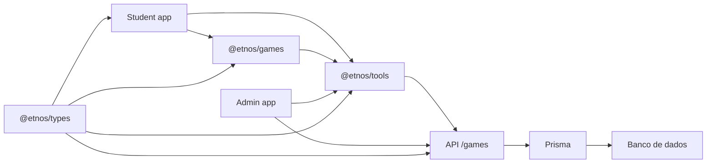
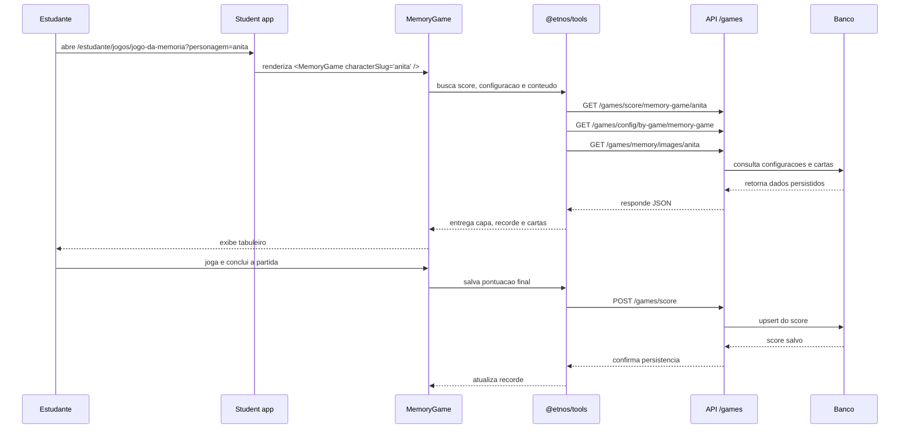

# Arquitetura dos jogos

## Visao geral

Os jogos do Etnos foram organizados para separar bem experiencia visual, regras
de negocio, integracao com API e persistencia. A feature de games hoje atravessa
seis partes principais do monorepo:

- `apps/student`: entrega a experiencia jogavel para o estudante.
- `apps/admin`: permite configurar conteudo e capas dos jogos.
- `apps/games`: biblioteca React com os jogos reutilizaveis.
- `apps/api`: expoe endpoints autenticados para configuracao, conteudo e score.
- `packages/tools`: hooks e services que conectam frontend e API.
- `packages/types`: enums e interfaces compartilhadas entre apps e pacotes.

## Fluxo de alto nivel

## Camadas e responsabilidades

### `apps/student`

O portal do estudante controla navegacao, breadcrumb e contexto da experiencia.
As paginas de jogos ficam em `app/jogos` e delegam a renderizacao para o
componente `Games`, que decide qual jogo da biblioteca deve ser exibido.

Responsabilidades principais:

- selecionar o tipo de jogo pela rota;
- recuperar o personagem via query string;
- renderizar o layout da experiencia no contexto do estudante.

### `apps/games`

E a biblioteca compartilhada de jogos. Ela concentra a interface, os estados do
jogo e os componentes reutilizaveis como placar e tela final.

Hoje a biblioteca exporta:

- `GuessGame`
- `MemoryGame`
- `FinishGame`
- `ScoreHighlight`

Isso permite que o `student` consuma um jogo pronto sem duplicar logica de
pontuacao, feedback visual ou integracao com score.

### `packages/tools`

Faz a ponte entre UI e backend. Nessa camada ficam:

- hooks de consulta como `useGameScore`, `useGamesConfig` e
  `useMemoryGameContent`;
- services HTTP como `scoreGamesService`, `configGamesService` e
  `memoryGameContentService`;
- utilitarios de experiencia, incluindo listagem dos jogos e reproducao de sons.

### `apps/admin`

O painel administrativo opera o lado editorial dos jogos. No caso do jogo da
memoria, o admin consegue:

- definir a imagem de capa por personagem;
- selecionar as imagens que formam o baralho;
- remover itens de conteudo cadastrados.

### `apps/api`

Centraliza as regras de persistencia. A controller `games.controller.ts` oferece
endpoints para:

- configuracao de capa por jogo e personagem;
- cadastro e remocao de conteudo do jogo da memoria;
- consulta e gravacao de pontuacoes;
- listagem de imagens formatadas para o frontend.

## Arquitetura do jogo da memoria

O jogo da memoria foi estruturado como uma experiencia configuravel por
personagem. Em vez de ter cartas fixas dentro da aplicacao, o frontend consome
um conjunto de imagens cadastrado pelo admin e o transforma em um tabuleiro.

### Componentes principais

- `MemoryGame.tsx`: ponto de integracao entre hooks, score, configuracao e UI.
- `MemoryGameExperience.tsx`: renderiza placar, grid de cartas e tela final.
- `useMemoryGame.ts`: gerencia estado do tabuleiro, pares, movimentos e score.
- `memory-game.utils.ts`: utilitarios de preparacao e embaralhamento das cartas.
- `memory-game.types.ts`: contratos locais da feature.

### Fluxo do jogo da memoria

## Modelo de configuracao do jogo da memoria

Existem duas fontes principais para montar a experiencia:

### 1. Configuracao visual

Persistida como configuracao de jogo por personagem. Nela fica, por exemplo, a
imagem de capa usada no verso das cartas.

Campos relevantes:

- `gameSlug`
- `characterSlug`
- `imageCoverUrl`

### 2. Conteudo do baralho

Persistido em itens de conteudo do jogo da memoria. Cada registro representa uma
imagem disponivel para duplicacao e montagem dos pares.

Campos relevantes:

- `id`
- `slug`
- `url`
- `idCharacter`

## Como o score funciona

O score do jogo da memoria fica vinculado a tres dimensoes:

- jogo;
- personagem;
- usuario.

Na API, a gravacao e feita com `upsert`, o que simplifica o fluxo de atualizar o
recorde do estudante sem criar duplicidade para a mesma combinacao.

## Relacao entre admin e experiencia do estudante

O jogo da memoria depende diretamente do painel administrativo:

- se o admin altera a capa, o verso das cartas muda no frontend;
- se o admin adiciona ou remove imagens, o conjunto de pares muda no jogo;
- se nao houver conteudo configurado para um personagem, o frontend fica sem
  cartas para montar a partida.

Essa separacao reduz deploys para ajustes de conteudo e deixa a equipe livre
para evoluir a curadoria das cartas sem alterar o codigo do jogo.

## Adicionando novos jogos

O fluxo atual favorece expansao incremental:

1. criar a implementacao em `apps/games/src/games`;
2. exportar o jogo em `apps/games/src/games/index.ts`;
3. conectar o jogo em `student/components/@molecules/Games/Games.tsx`;
4. registrar nome, descricao e rota em
   `packages/tools/src/hooks/useGames/useGames.ts`;
5. criar pagina no `student`;
6. adicionar configuracao administrativa e endpoints, se o jogo precisar de
   conteudo dinamico ou persistencia.

## Estado atual

Hoje a arquitetura de jogos cobre dois desafios principais:

- `guess-game`
- `memory-game`

O jogo da memoria e a feature mais configuravel da camada de games neste
momento, porque combina edicao de conteudo, configuracao visual por personagem e
persistencia de score por usuario.
