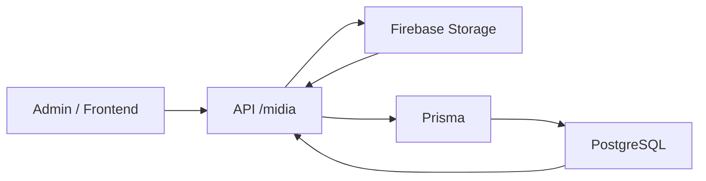
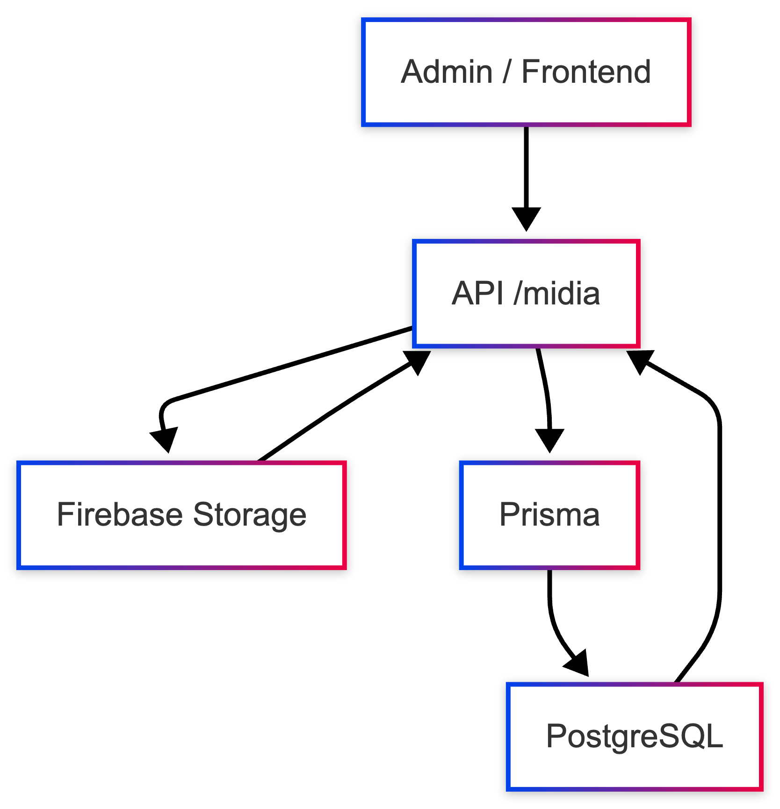
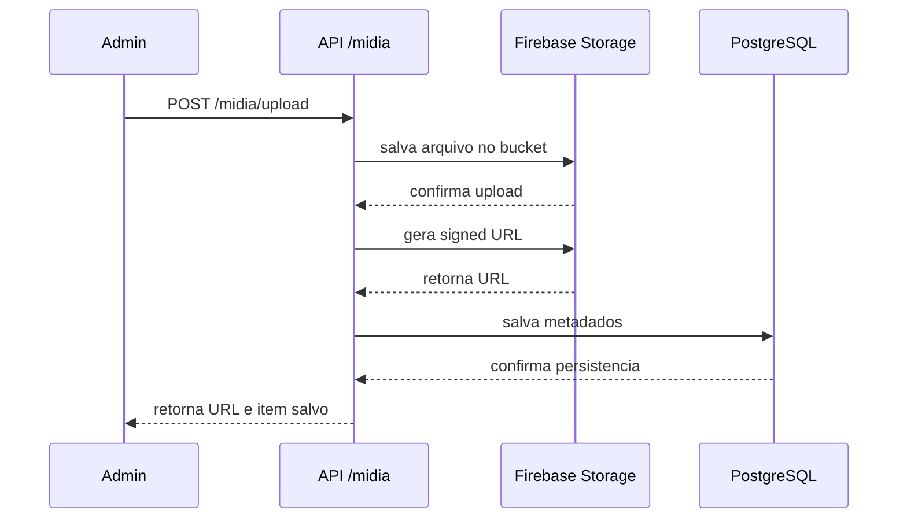
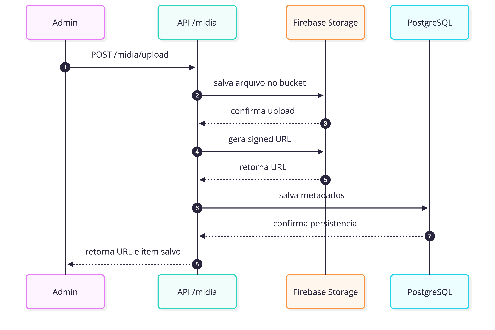

# Mídia

## Visão geral

O fluxo de mídia do Etnos é híbrido:

- o arquivo físico vai para o `Firebase Storage`;
- os metadados ficam na tabela `midia` no Postgres;
- a API centraliza upload, assinatura de URL, listagem e remoção.

## Diagrama da arquitetura

## Como esse fluxo foi organizado

Essa arquitetura deixa cada parte no lugar certo:

- armazenar arquivos grandes fora do banco;
- paginar e filtrar assets por usuário e pasta;
- reutilizar a mesma biblioteca de imagens no admin;
- desacoplar o dominio da URL assinada em si.

## Fluxo de upload

### Upload simples

1. o cliente envia `multipart/form-data` para `POST /midia/upload`;
2. a API recebe o arquivo e uma pasta opcional;
3. a API salva o binario no bucket do Firebase;
4. a API gera uma signed URL de leitura;
5. a API persiste `url`, `folder`, `path` e `userId` na tabela `midia`;
6. o frontend passa a consumir esse item pela biblioteca de imagens.

### Upload múltiplo

O endpoint `POST /midia/upload/multiple` repete o mesmo fluxo para vários
arquivos em paralelo.

## Fluxo de consulta

Os assets são listados por usuário autenticado com suporte a:

- `limit`
- `page`
- `folder`

O retorno inclui:

- `data`: lista da página atual;
- `nextCursor`: página seguinte, quando existir.

## Fluxo de remoção

Existem três formas principais de apagar um asset:

- por URL, usando `DELETE /midia/by-url`;
- por ID, usando `DELETE /midia/:id`;
- por body, usando `DELETE /midia`.

Em todos os casos, a API tenta:

1. localizar o registro do usuário;
2. resolver o caminho real no bucket;
3. apagar o arquivo físico;
4. remover o metadado do Postgres.

## Diagrama de sequencia

## Modelo de dados

Tabela principal: `midia`

Campos relevantes:

- `id`
- `url`
- `folder`
- `path`
- `userId`
- `createdAt`
- `updatedAt`

Indices relevantes:

- indice por `userId`
- indice por `folder`

## Convenções importantes

### Pasta lógica

O campo `folder` funciona como agrupador funcional dos assets. Exemplos:

- `games/anita`
- `games/dandara`
- `uploads`

Essa convenção é importante porque a interface administrativa usa a pasta para
filtrar a biblioteca de imagens.

### Caminho físico

O `path` identifica o arquivo real no bucket. Quando ele não existe, a API
reconstrói o caminho a partir da URL assinada.

### Signed URL

As URLs de leitura são assinadas com validade muito longa, o que simplifica o
consumo no frontend e no admin.

## Integração com o admin

O fluxo de jogos depende diretamente da arquitetura de mídia:

- a capa do jogo da memória vem da biblioteca de imagens;
- as cartas do jogo da memória são selecionadas a partir dos assets de uma pasta
  por personagem;
- o componente `ImageLibrary` depende da listagem paginada da API.

## Endpoints principais

- `POST /midia/upload`
- `POST /midia/upload/multiple`
- `GET /midia`
- `GET /midia/folders`
- `POST /midia`
- `DELETE /midia/by-url`
- `DELETE /midia/:id`
- `DELETE /midia`

## Dependências externas

- `Firebase Storage`
- `PostgreSQL`
- `Prisma`
