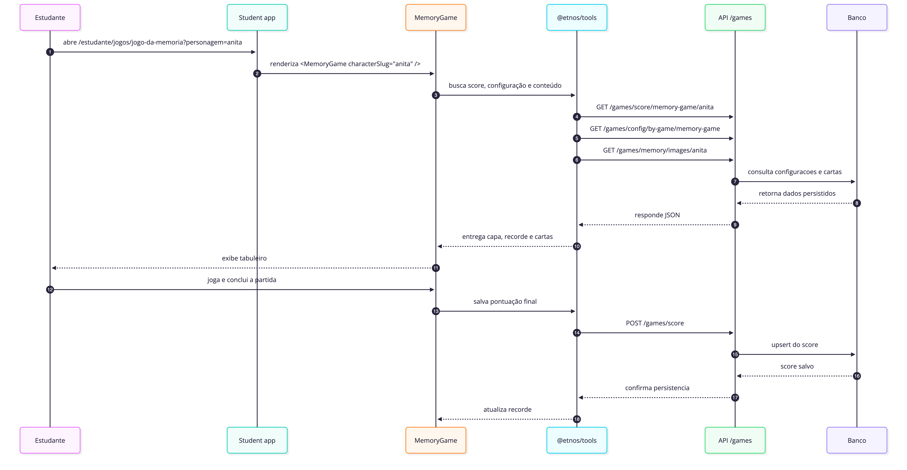

# Jogo da memória

O jogo da memória foi estruturado como uma experiência configurável por
personagem. Em vez de deixar cartas fixas dentro da aplicação, o frontend busca
um conjunto de imagens cadastrado no admin e transforma isso em tabuleiro.

## Componentes principais

| Arquivo | Papel |
| :--- | :--- |
| `MemoryGame.tsx` | Integração com hooks, score, sessão, NPS e analytics |
| `MemoryGameExperience.tsx` | Placar, grid de cartas, níveis e tela final |
| `MemoryGameLevelSelector.tsx` | Escolha de dificuldade (pares / tempo) |
| `useMemoryGame.ts` | Estado do tabuleiro, pares, movimentos e pontuação |
| `@etnos/core` | Utilitários de preparação, embaralhamento e pontuação (mobile) |

## Fluxo do jogo da memória

## Como o jogo é montado

Para montar a experiência, o jogo usa duas fontes principais.

### 1. Configuração visual

Fica salva como configuração de jogo por personagem. É daí que sai, por
exemplo, a imagem de capa usada no verso das cartas.

Campos relevantes:

- `gameSlug`
- `characterSlug`
- `imageCoverUrl`

### 2. Conteúdo do baralho

Fica salvo nos itens de conteúdo do jogo da memória. Cada registro representa
uma imagem disponível para duplicação e montagem dos pares.

Campos relevantes:

- `id`
- `slug`
- `url`
- `idCharacter`

## Níveis de dificuldade

O estudante escolhe o nível antes de iniciar (`MemoryGameLevelSelector`). Cada
nível define quantidade de pares e impacto na pontuação final.

## Pontuação e persistência

- pontos por par encontrado e bônus conforme nível e movimentos;
- ao terminar, `MemoryGameExperience` salva recorde e histórico automaticamente;
- `GameNpsModal` pode ser exibido após vitória;
- sons de flip, erro e conclusão via `playSound` do host.

## Analytics

| Evento | Momento |
| :--- | :--- |
| `game_selected` | Escolha do jogo |
| `game_finished` | Partida encerrada na UI |
| `game_session_completed` | Histórico gravado no backend |

## Onde roda

| Plataforma | Integração |
| :--- | :--- |
| Web (`apps/student`) | `@etnos/games` + `@etnos/tools` |
| Mobile (`apps/student-mobile`) | `MemoryGameBoard` + `@etnos/core` |

## Admin

Em `apps/admin`, a equipe define capa e imagens do baralho por personagem.
Sem conteúdo configurado, o frontend não monta cartas para a partida.

Mais contexto: [Arquitetura dos jogos](games-architecture.md).
