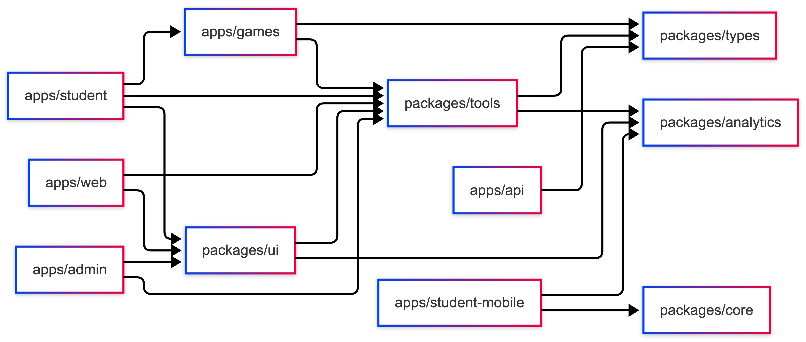
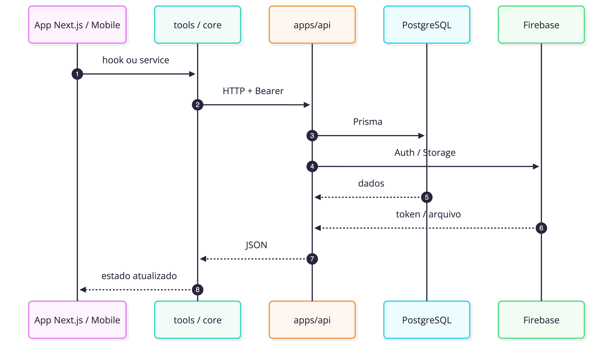

# Monorepo

## Visão geral

O Etnos está organizado como um monorepo com apps de produto, biblioteca de
jogos, design system, contratos compartilhados, analytics e testes de performance.
Cada app tem um papel claro; os pacotes evitam duplicação de código.

## Mapa geral



## Apps

### `apps/web`

Site institucional e porta de entrada pública.

- landing page, cadastro e login;
- comunicação com a API;
- analytics via `@etnos/analytics` (`appName: web`).

### `apps/student`

Portal autenticado do estudante.

- seleção de personagem e jogos;
- perfil e onboarding escolar;
- renderização de `@etnos/games`;
- analytics (`appName: student`).

### `apps/admin`

Painel de operação e conteúdo.

- escolas, personagens habilitados, jogos por escola;
- biblioteca de mídia e configuração de jogos;
- dashboard de desempenho e notificações push;
- analytics (`appName: admin`).

### `apps/api`

Backend NestJS — fonte de verdade do domínio.

- validação de token Firebase;
- persistência PostgreSQL via Prisma;
- uploads no Firebase Storage;
- métricas Prometheus e integração Sentry;
- cache de catálogo de personagens para leitura pública.

Porta padrão: **8080** (`PORT` no `.env`). Prefixo global: `/api`.

### `apps/games`

Biblioteca React de jogos (`GuessGame`, `MemoryGame`, NPS, placar).

### `apps/docs`

Storybook do design system (porta **6006**).

### `apps/student-mobile`

App Expo (iOS, Android, Web). Ver [App mobile](mobile-architecture.md).

## Pacotes

Resumo completo em [Pacotes compartilhados](packages-overview.md).

| Pacote                       | Papel                              |
| ---------------------------- | ---------------------------------- |
| `packages/ui`                | Design system e `AppProviders` web |
| `packages/tools`             | Hooks e HTTP para apps Next        |
| `packages/core`              | Cliente HTTP e sessão mobile       |
| `packages/types`             | Contratos TypeScript               |
| `packages/analytics`         | Mixpanel web/native                |
| `packages/performance`       | Testes k6 (não é runtime)          |
| `packages/typescript-config` | Presets TS                         |
| `packages/eslint-config`     | Presets ESLint                     |
| `packages/tailwind-config`   | Preset Tailwind                    |

## Layouts web

- `web`: `AppProviders` sem bloqueio de auth;
- `student` e `admin`: `AppProviders` + `AuthProtected`.

Isso alinha cabeçalho, rodapé, locale, tema Ant Design e React Query.

## Fluxo entre camadas



## Monorepo tooling

| Ferramenta       | Uso                                           |
| ---------------- | --------------------------------------------- |
| Yarn Workspaces  | dependências entre pacotes                    |
| Turborepo        | `build`, `dev`, `lint`, `test`, `check-types` |
| MkDocs           | documentação em `docs-site/`                  |
| semantic-release | versionamento (`CHANGELOG.md`)                |

### Scripts na raiz

```bash
yarn dev          # sobe apps em paralelo
yarn build
yarn test
yarn lint
yarn check-types
```
