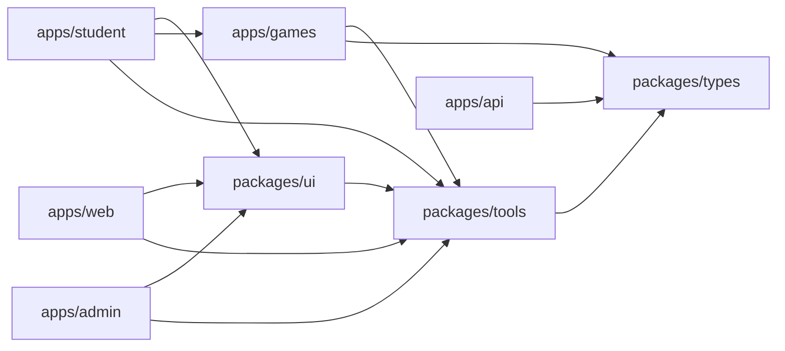
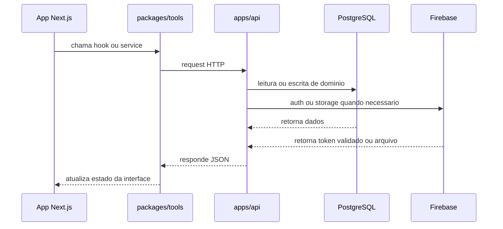

# Monorepo e apps

## Visao geral

O Etnos esta organizado como um monorepo com apps de produto, biblioteca de
componentes, biblioteca de jogos, contratos compartilhados e utilitarios de
integracao. A estrutura atual prioriza reuso de codigo e separacao clara de
responsabilidades.

## Mapa de alto nivel

## Apps do repositorio

### `apps/web`

Site institucional e porta de entrada publica da plataforma.

Responsabilidades:

- landing page;
- cadastro e login;
- comunicacao publica com a API;
- apresentacao da proposta pedagogica.

### `apps/student`

Portal autenticado do estudante.

Responsabilidades:

- selecao de personagem;
- acesso aos jogos;
- perfil do estudante;
- renderizacao da experiencia de aprendizado.

### `apps/admin`

Painel autenticado de operacao.

Responsabilidades:

- gestao de escolas;
- gestao de personagens;
- gestao de midia;
- configuracao e conteudo de jogos.

### `apps/api`

Backend NestJS e fonte principal de verdade do dominio.

Responsabilidades:

- autenticar requests com token do Firebase;
- persistir dados de negocio no Postgres via Prisma;
- intermediar upload e remocao de arquivos no Firebase Storage;
- expor endpoints publicos e autenticados.

### `apps/games`

Biblioteca React de jogos.

Responsabilidades:

- encapsular interface e logica dos jogos;
- expor componentes reutilizaveis para `student`;
- manter estados, pontuacao e experiencia visual de cada jogo.

### `apps/docs`

Storybook do design system e dos componentes compartilhados.

## Pacotes compartilhados

### `packages/ui`

Design system, providers, layout principal e guards.

Pontos importantes:

- `AppProviders` cria o `QueryClient` e provedor de usuario;
- `MainLayout` injeta header, footer, analytics e configuracao global do Ant
  Design;
- `AuthProtected` protege rotas autenticadas.

### `packages/tools`

Camada de integracao e logica de consumo.

Responsabilidades:

- hooks baseados em React Query;
- services HTTP;
- helpers de sessao, token, erros e utilitarios;
- listagem de jogos e reproducao de sons.

### `packages/types`

Contratos compartilhados entre apps, API e bibliotecas.

Responsabilidades:

- interfaces de usuario, escola, personagem e midia;
- enums e contratos dos jogos;
- tipagem comum do dominio.

## Composicao dos layouts

Os apps web reutilizam o mesmo layout base e os mesmos providers, com pequenas
diferencas de protecao:

- `web` usa `AppProviders` sem bloqueio de autenticacao;
- `student` usa `AppProviders` com `AuthProtected`;
- `admin` usa `AppProviders` com `AuthProtected`.

Isso reduz duplicacao e mantem cabecalho, rodape, locale, tema e cache de
queries alinhados entre as interfaces.

## Fluxo tipico entre camadas

## Build e orquestracao

O monorepo usa `Turborepo` com tarefas compartilhadas para:

- `build`
- `dev`
- `lint`
- `test`
- `check-types`

O cache considera saidas como `dist`, `.next`, `storybook-static` e `coverage`,
enquanto `dev` permanece sem cache e em modo persistente.

## O que vale documentar junto com esta pagina

Esta pagina funciona como ponto de partida. Para aprofundar:

- veja `auth-architecture.md` para login e sessao;
- veja `media-architecture.md` para upload e storage;
- veja `games-architecture.md` para a feature de jogos;
- veja `database-architecture.md` para persistencia e relacoes.
