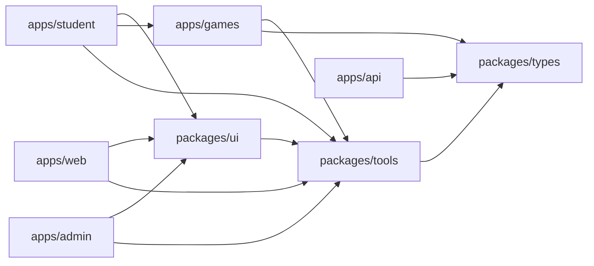
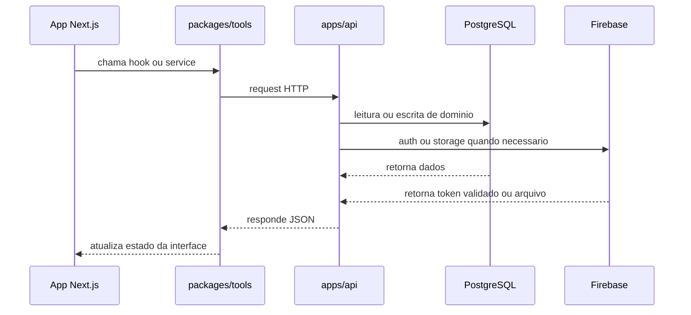

# Monorepo

## Visão geral

O Etnos está organizado como um monorepo com apps de produto, biblioteca de
componentes, biblioteca de jogos, contratos compartilhados e utilitários de
integração. A ideia aqui é simples: cada app tem um papel claro, e os pacotes
compartilhados evitam repetição de código.

## Mapa geral

## Apps

### `apps/web`

Site institucional e porta de entrada pública da plataforma.

Responsabilidades:

- landing page;
- cadastro e login;
- comunicacao publica com a API;
- apresentacao da proposta pedagogica.

### `apps/student`

Portal autenticado do estudante.

Responsabilidades:

- selecao de personagem;
- acesso aos jogos;
- perfil do estudante;
- renderização da experiência de aprendizado.

### `apps/admin`

Painel autenticado de operação.

Responsabilidades:

- gestao de escolas;
- gestao de personagens;
- gestão de mídia;
- configuração e conteúdo de jogos.

### `apps/api`

Backend NestJS e fonte principal de verdade do domínio.

Responsabilidades:

- autenticar requests com token do Firebase;
- persistir dados de negocio no Postgres via Prisma;
- intermediar upload e remoção de arquivos no Firebase Storage;
- expor endpoints publicos e autenticados.

### `apps/games`

Biblioteca React de jogos.

Responsabilidades:

- encapsular interface e lógica dos jogos;
- expor componentes reutilizaveis para `student`;
- manter estados, pontuação e experiência visual de cada jogo.

### `apps/docs`

Storybook do design system e dos componentes compartilhados.

## Pacotes

### `packages/ui`

Design system, providers, layout principal e guards.

Pontos importantes:

- `AppProviders` cria o `QueryClient` e provedor de usuário;
- `MainLayout` injeta header, footer, analytics e configuração global do Ant
  Design;
- `AuthProtected` protege rotas autenticadas.

### `packages/tools`

Camada de integração e lógica de consumo.

Responsabilidades:

- hooks baseados em React Query;
- services HTTP;
- helpers de sessão, token, erros e utilitários;
- listagem de jogos e reprodução de sons.

### `packages/types`

Contratos compartilhados entre apps, API e bibliotecas.

Responsabilidades:

- interfaces de usuário, escola, personagem e mídia;
- enums e contratos dos jogos;
- tipagem comum do dominio.

## Layouts

Os apps web reutilizam o mesmo layout base e os mesmos providers, com pequenas
diferenças de proteção:

- `web` usa `AppProviders` sem bloqueio de autenticação;
- `student` usa `AppProviders` com `AuthProtected`;
- `admin` usa `AppProviders` com `AuthProtected`.

Isso reduz duplicação e mantém cabeçalho, rodapé, locale, tema e cache de
queries alinhados entre as interfaces.

## Fluxo entre camadas

## Build

O monorepo usa `Turborepo` com tarefas compartilhadas para:

- `build`
- `dev`
- `lint`
- `test`
- `check-types`

O cache considera saídas como `dist`, `.next`, `storybook-static` e `coverage`,
enquanto `dev` permanece sem cache e em modo persistente.
