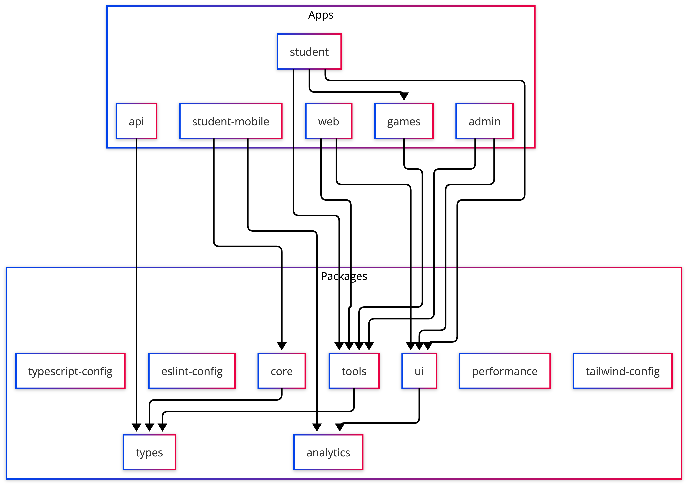

# Pacotes compartilhados

## Visão geral

Os pacotes em `packages/` concentram código reutilizável entre apps. Apps não
devem duplicar lógica de HTTP, tipos ou componentes que já existem aqui.

## Pacotes de produto

### `@etnos/ui`

Design system web: componentes Atomic Design, `AppProviders`, `MainLayout`,
`AuthProtected`, formulários compartilhados.

- integra `MixpanelProvider` para apps Next;
- usa Ant Design + Tailwind conforme o app.

### `@etnos/services`

Clientes HTTP e serviços de domínio usados pelos hooks web e, em parte, pelo
mobile:

| Módulo | Exemplos |
| :--- | :--- |
| `authSession` | Sessão e token Firebase |
| `games` | `guessGameContentService`, `memoryGameContentService`, `scoreGamesService` |
| `school` | Escolas, onboarding, habilitação de jogos |
| `users`, `characters`, `midia`, `notifications`, `dashboard` | Demais domínios |

É a camada preferida para **novas chamadas HTTP**; os hooks em `@etnos/tools`
consomem estes serviços.

### `@etnos/tools`

Hooks React Query e helpers para apps web:

| Área | Exemplos |
| :--- | :--- |
| Auth | `useAuth` |
| Personagens | `useCharacter` |
| Jogos | `useGames`, `useGameScore`, `useGuessGamePlayableContent`, `useMemoryGameContent`, `useMyGameAccess` |
| Dashboard | `useStudentDashboard`, `useAdminPerformanceDashboard` |
| Escolas / admin | `useSchools`, `useManagedSchools`, `useAdminUsers` |
| Notificações | `useNotificationTemplates`, `useNotificationMutations` |

### `@etnos/core`

Cliente HTTP, storage de sessão e serviços usados pelo **mobile**. Espelha parte
do que `tools` + `services` fazem na web, adaptado ao React Native.

### `@etnos/types`

Contratos TypeScript compartilhados: usuário, escola, personagem, jogos, mídia.
Fonte única para alinhar API e frontends.

### `@etnos/analytics`

SDK Mixpanel unificado (web e native). Ver [Analytics](analytics-architecture.md).

## Biblioteca de jogos (`apps/games`)

Pacote workspace `@etnos/games` — **não** fica em `packages/`, mas é consumido
como dependência interna:

- `GuessGame`, `MemoryGame`, `FinishGame`, `GameNpsModal`, `ScoreHighlight`;
- integração de rede via hooks do host (`@etnos/tools` na web).

Ver [Arquitetura dos jogos](games-architecture.md).

## Pacotes de infraestrutura

| Pacote                     | Uso                            |
| -------------------------- | ------------------------------ |
| `@etnos/typescript-config` | Presets `tsconfig` do monorepo |
| `@etnos/eslint-config`     | Regras de lint compartilhadas  |
| `@etnos/tailwind-config`   | Tokens e preset Tailwind       |

## `@etnos/performance`

Testes de carga com **k6** (não é dependência de runtime dos apps). Ver
[Testes de performance](performance-tests.md).

## Convenções

- importar pacotes pelo nome `@etnos/<pacote>`;
- tipos de domínio novos entram primeiro em `@etnos/types`;
- HTTP novo: serviço em `@etnos/services`, hook em `@etnos/tools` (web) ou `@etnos/core` (mobile);
- eventos de analytics passam por `@etnos/analytics`, nunca pelo SDK direto;
- apps Next que usam pacotes com `NEXT_PUBLIC_*` precisam de
  `transpilePackages` no `next.config.ts`.
