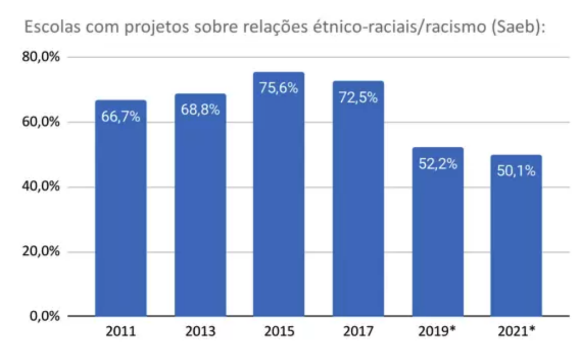
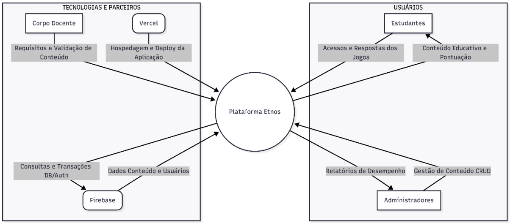

# Projeto Interdisciplinar I - ETNOS: Gamificando a diversidade

Documento histórico acadêmico (referência de 2025).

**INSTITUTO FEDERAL DO PARANÁ – CAMPUS PINHAIS**

_Curso de Gestão da Tecnologia da Informação_

AVA MOREIRA DE LIMA | JOÃO LUIZ VICENTE JUNIOR

_Pinhais/2025_

> Projeto apresentado à disciplina de Projeto Interdisciplinar I, do curso de
> Gestão da Tecnologia da Informação, do Instituto Federal do Paraná Campus
> Pinhais, desenvolvido sob a orientação das professoras Eliana Maria dos Santos
> e Lauriana Paludo.

---

## RESUMO

O projeto “ETNOS: Gamificando a Diversidade" surge da necessidade de promover a igualdade e o respeito às relações étnico-raciais no ambiente escolar, um tema que muitas vezes abordado de forma superficial. Esta iniciativa concentra-se no desenvolvimento e na aplicação de um jogo digital educativo chamado Etnos, utilizando a metodologia Design Thinking como base pedagógica e tecnológica. O objetivo central é fomentar reflexões sobre identidade, respeito, convivência, empatia e justiça social entre estudantes do Ensino Fundamental (8 a 12 anos), através de uma experiência lúdica e interativa. O jogo busca destacar as contribuições de povos afro-brasileiros, indígenas e de outras etnias na construção da sociedade brasileira, com desafios como quizzes, jogos da memória e atividades de correspondência. A primeira entrega foca em um resultado de impacto social e pedagógico, combatendo preconceitos e fortalecendo a educação inclusiva de qualidade, alinhando-se aos Objetivos de Desenvolvimento Sustentável (ODS) 4 e 10.

**Palavras-chave:** Etnos; diversidade cultural; jogo digital educativo;
direitos humanos; educação inclusiva.

---

## 1 - INTRODUÇÃO

No Brasil existe uma grande diversidade cultural e étnico-racial, uma
característica muito forte para a nossa cultura. Por essa razão, a Lei nº
11.645/08 estabeleceu a obrigatoriedade do ensino da História e Cultura
Afro-Brasileira e Indígena no currículo escolar, reconhecendo a importância do
tema para a formação cidadã. Porém, a implementação desse conteúdo nas escolas
públicas enfrenta um desafio significativo: a dificuldade ao acesso de
ferramentas pedagógicas. Muitos educadores não têm materiais didáticos adequados
para abordar a complexidade das relações étnico-raciais e o combate ao
preconceito de forma lúdica e acessível para crianças.

Diante desta necessidade no processo de ensino-aprendizagem, o presente trabalho
propõe o desenvolvimento de "Etnos: Gamificando a Diversidade", uma plataforma
de jogos digitais educativos. Alinhada aos Objetivos de Desenvolvimento
Sustentável (ODS) 4 e 10, a proposta busca complementar o ensino formal,
utilizando a gamificação como estratégia para o desenvolvimento de empatia,
consciência cultural e justiça social. O jogo Etnos envolverá estudantes em uma
jornada interativa por diferentes culturas brasileiras, utilizando desafios como
quizzes, jogos da memória e atividades de correspondência. A meta é oferecer uma
solução tecnológica e pedagógica que combata ativamente os comportamentos
preconceituosos, promovendo o conhecimento das contribuições dos diversos povos
na construção da sociedade brasileira.

## 2 - Objetivos

### 2.1 Objetivo Geral

O objetivo geral do projeto é desenvolver uma plataforma de jogos digitais
educativos, utilizando a gamificação como ferramenta tecnológica e pedagógica
para o ensino da diversidade cultural e das relações étnico-raciais brasileiras
no Ensino Fundamental.

### 2.2 Objetivos específicos

- Desenvolver uma plataforma de jogos digitais funcionais, com arquitetura
  escalável e modular, conforme o cronograma e as especificações técnicas
  definidas neste projeto;

- Implementar os jogos digitais junto aos estudantes do ensino fundamental,
  visando validar os objetivos e avaliar os impactos propostos;

- Criar e integral um painel administrativo para o gerenciamento de usuários e
  do conteúdo dos jogos permitindo que os administradores da plataforma possam
  gerenciar os dados existentes na plataforma;

- Estruturar o conteúdo temático dos jogos para valorizar e difundir as
  tradições, histórias, símbolos e saberes das culturas afro-brasileira e
  indígena;

- Projetar a interface e a experiência do usuário dos jogos, aplicando a
  metodologia Design Thinking e utilizando protótipos de alta fidelidade no
  Figma, garantindo acessibilidade e adequação ao público-alvo;

- Realizar testes de usabilidade e funcionalidade na plataforma e no painel
  administrativo, a fim de aperfeiçoar o fluxo de navegação e assegurar uma
  experiência lúdica e pedagógica.

## 3 - Justificativa

Conforme discutido por Silva, Almeida e Lima (2025), a diversidade étnicoracial
desempenha um papel fundamental na formação social e cultural do Brasil,
resultado da miscigenação entre povos indígenas, africanos e europeus.
Reconhecer e valorizar essa pluralidade no contexto escolar é indispensável para
promover a inclusão, combater discriminações e fortalecer a identidade e a
autoestima de estudantes pertencentes a grupos historicamente marginalizados.

Nesse cenário, é essencial a implementação de práticas pedagógicas que
incentivem o respeito e o reconhecimento da diversidade cultural brasileira. No
entanto, dados do movimento Todos Pela Educação revelam um retrocesso
preocupante:

> O total de escolas públicas com projetos para combater racismo, machismo e
> homofobia caiu ao menor patamar em dez anos, segundo levantamento do Todos
> Pela Educação. Os dados utilizados foram extraídos dos questionários
> contextuais do Sistema Nacional de Avaliação Básica (Saeb) destinados a
> diretores e diretoras escolares, entre 2011 a 2021. Apenas metade das escolas
> (50,1%) tiveram ações contra o racismo em 2021 – quando foi feita a última
> pesquisa do Saeb. Em 2015, o índice havia chegado ao maior patamar no período:
> 75,6%. Desde então, os números despencaram de maneira contínua. Gráfico
> abaixo:

_Fonte: TODOS PELA EDUCAÇÃO. Apenas metade das escolas públicas têm projetos
para combater o racismo no Brasil. 2022._

## 4 - Trabalhos correlatos

| Título do Projeto                                                                                 | Autor                                                                                               | Onde foi realizado                                                                                                 | Descrição do projeto                                                                                                                                                                                                                                                                                                                                                                                                                                                                                                                                                                                                                                              | Fonte de informação sobre o projeto                                                                                                                                                                                                                                                                                             |
| ------------------------------------------------------------------------------------------------- | --------------------------------------------------------------------------------------------------- | ------------------------------------------------------------------------------------------------------------------ | ----------------------------------------------------------------------------------------------------------------------------------------------------------------------------------------------------------------------------------------------------------------------------------------------------------------------------------------------------------------------------------------------------------------------------------------------------------------------------------------------------------------------------------------------------------------------------------------------------------------------------------------------------------------- | ------------------------------------------------------------------------------------------------------------------------------------------------------------------------------------------------------------------------------------------------------------------------------------------------------------------------------- |
| Projeto “Raízes do Brasil – Cartas da Resistência”                                                | Professor Paulo Rosa (licenciado em Geografia)                                                      | Cassilândia - MS                                                                                                   | O trabalho teve como objetivo principal destacar a contribuição de povos indígenas, africanos e afrodescendentes na formação do país através de um jogo intitulado como “Raízes do Brasil – Cartas da Resistência” no qual dois jogadores disputam partidas que envolvem alternar ataque e defesa, utilizando atributos históricos e culturais para vencer confrontos. O jogo permite exercitar o raciocínio lógicomatemático e, ao mesmo tempo, aprofundar conhecimentos histórico-geográficos.                                                                                                                                                                  | [Acesse Aqui](https://www.sed.ms.gov.br/estudantes-decassilandia-criam-jogo-de-cartas-para-ensinarhistoria-e-valorizar-diversidade-cultural/)                                                                                                                                                                                   |
| Educação para a diversidade: Jogos lúdicos como ferramenta de aprendizagem                        | Izabela Cristine de Alcântara Sathler; Fernanda Cristina Pinheiro Chaves; Vanessa Carvalho Barbosa. | Minas Gerais (Por alunas do curso de Licenciatura em Ciências Sociais pela Pontifícia Universidade Católica de MG) | O artigo descreve o desenvolvimento e a aplicação de um jogo lúdico chamado "Quiz da Diversidade", criado por estudantes de Licenciatura em Ciências Sociais com o objetivo de promover a reflexão e o conhecimento sobre a história de grupos minoritários de forma lúdica. O jogo envolve temas como diversidade étnico-racial, de gênero, orientação sexual e religiosa, utilizando perguntas de verdadeiro ou falso e de múltipla escolha. As equipes que acertam ganham palavras que, no final, formam a frase "O respeito a diversidade anula a violência", promovendo a reflexão e o conhecimento sobre a história de grupos minoritários de forma lúdica. | [Acesse Aqui](https://editorarealize.com.br/editora/anais/enalic/2018/443-54879-27112018-132417.pdf)                                                                                                                                                                                                                            |
| A Gamificação de conteúdos escolares: uma experiência a partir da diversidade cultural brasileira | Tatiane M. de O. Martins; Jesse Nery Filho; Frank Vieira dos Santos; Ewertton Carneiro Pontes       | Programas de PósGraduação do Rio de Janeiro e da Bahia.                                                            | O artigo argumenta a eficácia da gamificação para o engajamento e a abordagem transdisciplinar na cultura brasileira. Foi realizada uma atividade de implementação de um jogo, porém em uma turma de pós-graduação, um público diferente do público-alvo deste projeto.                                                                                                                                                                                                                                                                                                                                                                                           | [Acesse Aqui](https://www.researchgate.net/profile/Jesse-Nery-Filho/publication/330970535_A_Gamificacao_de_conteudos_escolares_uma_experiencia_a_partir_da_diversidade_cultural_brasileira/links/5c5dd34492851c48a9c2ea03/A-Gamificacao-de-conteudos-escolares-uma-experiencia-a-partir-da-diversidade-cultural-brasileira.pdf) |

### 4.1. Análise dos trabalhos correlatos encontrados

Os trabalhos correlatos demonstram a relevância da gamificação para abordar a
diversidade, mas revelam lacunas que o Projeto “ETNOS: Gamificando a
Diversidade” se propõe a minimizar, principalmente no que tange a natureza e o
escopo da solução.

Os projetos "Raízes do Brasil" e o "Quiz da Diversidade" utilizam jogos físicos
ou analógicos. Embora eficazes, estas soluções dependem da replicação manual,
exigem material físico e limitam a coleta de dados e a escalabilidade. Em
contrapartida, a plataforma Etnos prevê o desenvolvimento de jogos digitais
acessíveis via web, garantindo maior alcance, acessibilidade e distribuição sem
custos de material.

Por se tratar de uma ferramenta tecnológica, o projeto é focado na construção de
uma solução robusta e gerenciável. Diferente das experiências análogas, o
projeto inclui o desenvolvimento de um painel Administrativo para gestão de
usuários, escolas e, futuramente, do conteúdo dos jogos, o que permite o
monitoramento do desempenho dos alunos e a atualização contínua do material
pedagógico, algo inviável em jogos físicos.

Além disso, o artigo que apresenta uma experiência gamificada na pósgraduação
reforça a eficácia da gamificação no processo de aprendizagem, porém trata-se de
uma prática voltada a adultos. Já o projeto Etnos tem como foco crianças do
ensino fundamental, sendo desenvolvido com tecnologias digitais que oferecem uma
experiência de usuário (UI/UX) mais envolvente e alinhada às expectativas e ao
cotidiano da geração atual.

## 5. Materiais e métodos

Para o desenvolvimento do projeto utilizamos uma metodologia conhecida como
“design thinking" que coloca a experiência dos usuários no centro do processo.
Essa metodologia foi usada para pensar e estruturar o desenvolvimento do
recurso, garantindo que o resultado fosse relevante e atende os objetivos
propostos no início do projeto.

### 5.1 Etapa de Inspiração

A fase de inspiração foi a base para a criação da plataforma. O objetivo foi
entender o público-alvo e o contexto em que o projeto se insere, garantindo que
os jogos fossem relevantes e com alto engajamento.

#### 5.1.1 Público-Alvo

O público-alvo foi estrategicamente definido como estudantes do 5º ano do Ensino
Fundamental, na faixa etária de 8 a 12 anos. Essa seleção se justifica pela
relevância do período de transição cognitiva e social em que as crianças se
encontram. Nesta fase, os alunos estão em um estágio de desenvolvimento
intelectual no qual começam a formar seu pensamento crítico e sua identidade
social. É o momento ideal para a introdução de temas complexos como a
diversidade cultural do Brasil.

Essa forma lúdica da plataforma "Etnos" foca em complementar a educação formal,
que muitas vezes aborda esses temas de maneira superficial, oferecendo uma
ferramenta interativa que estimula a curiosidade e o engajamento. A gamificação
é empregada como um método para promover a empatia, o respeito e a valorização
das múltiplas culturas, preparando os estudantes para se tornarem cidadãos mais
conscientes e tolerantes em uma sociedade diversificada. A plataforma atende a
uma demanda por recursos didáticos inovadores que fortaleçam o aprendizado e a
conscientização sobre a importância do respeito às diferenças.

#### 5.1.2 Alinhamento com os Objetivos de Desenvolvimento Sustentável (ODS)

A ideia do projeto "Etnos" está conectada a dois dos 17 Objetivos de
Desenvolvimento Sustentável (ODS) da Agenda 2030 da ONU, reforçando seu impacto
social e educacional:

##### 5.1.2.1 ODS 4 - Educação de Qualidade

O projeto contribui diretamente para a meta de "assegurar a educação inclusiva e
equitativa e de qualidade, e promover oportunidades de aprendizagem ao longo da
vida para todos". Ao disponibilizar um jogo educativo que aborda a diversidade
cultural de forma acessível, oferecemos uma ferramenta de ensino complementar
que pode ser utilizada em escolas públicas. Isso promove a equidade no acesso à
informação sobre a riqueza cultural do Brasil, um tema frequentemente
negligenciado.

##### 5.1.2.2 ODS 10 - Redução de Desigualdades

Ao focar no combate ao preconceito e na valorização das culturas
invisibilizadas, a ferramenta contribui para "reduzir a desigualdade dentro dos
países e entre eles". O projeto busca explicitamente destacar as contribuições
históricas e culturais dos povos diversos existentes na história brasileira,
combatendo estereótipos e promovendo o reconhecimento mútuo. Ao fomentar o
respeito e a empatia desde a infância, o "Etnos" atua na raiz do problema,
construindo uma base para uma sociedade mais justa e inclusiva.

#### 5.1.3 Personas

A partir de análises comportamentais do público-alvo, foram criadas duas
personas que representam os perfis mais relevantes de usuários. Ambas são alunas
do 5º ano do Ensino Fundamental I, com 10 a 11 anos, e frequentam a Escola
Municipal João Leopoldo Jacomel, em Pinhais.

##### 5.1.3.1 Ana Clara

A persona de Ana Clara representa a aluna engajada, curiosa e empática. Ela
possui um interesse natural por aprender brincando e por explorar histórias e
culturas diferentes. Sua motivação principal é entender e valorizar seus colegas
e as diferenças entre eles. Ana Clara já presenciou situações de preconceito e,
por isso, busca ativamente ferramentas que a ajudem a reagir de forma
construtiva. Ela tem um estilo de aprendizagem visual e interativo, preferindo
jogos e quizzes. O projeto "Etnos" a atrai por oferecer um ambiente seguro e
divertido para expandir seu conhecimento cultural e fortalecer sua empatia.

##### 5.1.3.2 Manuela

A persona de Manuela simboliza a aluna com pouca consciência social sobre
diversidade. Vinda de um ambiente familiar onde o tema não é frequentemente
discutido, ela pode, inadvertidamente, reproduzir discursos ou comportamentos
preconceituosos por falta de compreensão. O principal desafio de Manuela é
desenvolver um senso crítico e reconhecer a importância das culturas que compõem
a sociedade brasileira. Apesar disso, ela é curiosa e tem vontade de aprender,
especialmente após discussões em sala de aula sobre respeito às diferenças. Para
ela, o jogo "Etnos" é uma ferramenta fundamental que oferece uma introdução
lúdica e acessível a temas complexos, auxiliando-a no combate ao preconceito e
no desenvolvimento de habilidades socioemocionais.

### 5.2 Etapa de Ideação

A Etapa de Ideação foi dedicada à geração e ao desenvolvimento de soluções que
atendessem aos requisitos e objetivos do projeto. Utilizando as ideias reunidas
na fase de inspiração, o foco foi transformar a necessidade de promover a
diversidade cultural em um produto digital funcional. As atividades centrais
desta fase incluíram a criação do storyboard e a prototipação de mockups de alta
fidelidade.

#### 5.2.1 Storyboard

O storyboard foi a primeira ferramenta utilizada para mapear e visualizar a
jornada do usuário na aplicação. Nele, a professora introduz de forma breve o
tema da diversidade étnico-racial e apresenta o recurso de maneira resumida
despertando o interesse dos alunos. Em seguida, eles observam as telas gerais do
aplicativo, onde aparecem personagens de diferentes culturas, e uma das alunas
expressa o desejo de jogar com um personagem do seu próprio estado. Esse roteiro
visual permitiu estruturar o fluxo narrativo principal — uma jornada por
diferentes regiões e culturas do Brasil — e assegurou que a experiência fosse
lógica, interativa e pedagógica. Além disso, contribuiu para validar a proposta,
a progressão das fases e a integração das mecânicas, garantindo que o personagem
principal interagisse com figuras representativas de cada etnia e região,
evidenciando a coesão entre o conteúdo cultural e a dimensão lúdica da
experiência.

#### 5.2.2 Prototipação

A ferramenta Figma foi utilizada para a criação dos protótipos de interface e
experiência do usuário (UI/UX). Esta escolha se justifica pela sua natureza
colaborativa e pela capacidade de criar protótipos interativos de alta
fidelidade, simulando a experiência final do jogo antes da fase de
desenvolvimento.

Os protótipos detalharam a aparência visual da plataforma (paleta de cores,
tipografia e estilo de arte). Foi dada atenção especial à acessibilidade visual
para o público infantil (8-12 anos), com elementos e contrastes adequados para
um design intuitivo. A prototipação no Figma incluiu a criação de telas
essenciais: a tela de login, o mapa interativo da jornada e as telas de como
será o desafio. A simulação interativa foi contribuiu nos testes iniciais de
usabilidade e refinar o fluxo de navegação.

Para navegar no protótipo, clique aqui:
[Figma](https://www.figma.com/proto/DC1bYnTWGpp1ppCLhuOm1e/Etnos?node-id=2-6&p=f&t=D7YYcgs2oQdpQxIR-1&scaling=min-zoom&content-scaling=fixed&page-id=0%3A1&starting-point-node-id=2%3A6).

## 6. Cronograma

O planejamento da execução técnica do projeto é detalhado no cronograma a
seguir, que organiza as atividades em quatro macro etapas principais:
Configuração Inicial, Desenvolvimento dos Jogos (Jogo da Memória e "Adivinhe o
Nome") e Implementação do Painel Administrativo.

O prazo total simulado para o desenvolvimento do Produto Mínimo Viável (MVP) é
de aproximadamente 24 (vinte e quatro) semanas. Este período compreende todas as
atividades, desde a preparação do ambiente de desenvolvimento até a homologação
final dos componentes e features principais.

A metodologia de desenvolvimento adotada prioriza a criação de uma arquitetura
robusta e escalável. O projeto será desenvolvido em um ambiente monorepo, com
uma biblioteca de componentes de interface de usuário e os jogos encapsulados em
módulos separados, conforme detalhado na Tabela 6.1. Esta arquitetura modular
facilita o reuso de código, a manutenção e garante uma base tecnológica suporte
a inclusão de futuros jogos e funcionalidades.

A Tabela 6.1 discrimina as tarefas por tipo de sprint (DevOps, Frontend,
Backend, Testes) e apresenta a previsão de tempo (por semana) para cada
atividade.

### 6.1 Configuração Inicial

| Tipo     | Tarefa                                                                    | Semana |
| -------- | ------------------------------------------------------------------------- | ------ |
| DevOps   | Configuração inicial do monorepo e ambiente produtivo (Firebase e Vercel) | 1      |
| Frontend | Camada de autenticação e cadastro de usuários                             | 2      |
| Frontend | Setup inicial para interface com Tailwind                                 | 1      |
| Frontend | Desenvolvimento da biblioteca de UI (@etnos/ui) com componentes básicos   | 2      |

### 6.2 Jogo da Memória

| Tipo                 | Tarefa                                                                | Semana |
| -------------------- | --------------------------------------------------------------------- | ------ |
| Pré-Análise          | Análise da lógica e regra de negócio do jogo                          | 1      |
| FrontEnd             | Desenvolvimento do jogo dentro da arquitetura de jogos (@etnos/games) | 2      |
| Testes e Homologação | Realização de testes de usabilidade e funcionalidade do jogo          | 1      |

### 6.3 Jogo "Adivinhe o Nome"

| Tipo                 | Tarefa                                                                | Semana |
| -------------------- | --------------------------------------------------------------------- | ------ |
| Pré-Análise          | Análise da lógica e regra de negócio do jogo                          | 1      |
| FrontEnd             | Desenvolvimento do jogo dentro da arquitetura de jogos (@etnos/games) | 2      |
| Testes e Homologação | Realização de testes de usabilidade e funcionalidade do jogo          | 1      |

### 6.4 Painel Administrativo

| Tipo        | Tarefa                                                         | Semana |
| ----------- | -------------------------------------------------------------- | ------ |
| Pré-Análise | Definição de requisitos do de usuário do admin app             | 0.5    |
| Backend     | Configuração e integração com FirebaseAuthentication           | 1      |
| -           | Implementação da lógica de autenticação no admin app           | 1      |
| -           | Criação das APIs para gerenciar usuários e conteúdo do jogo    | 4      |
| Frontend    | Desenvolvimento da interface e navegação do admin app          | 2      |
| -           | Implementação das telas de gerenciamento de usuários e escolas | 1      |
| DevOps      | Configuração do deploy de um ambiente de produção              | 1      |
| Testes      | Testes de funcionalidade das features do admin                 | 1      |

## 7. Resultados esperados

Nosso desafio é alcançar resultados significativos em três dimensões principais:
tecnológica, pedagógica e social. A entrega do Produto Mínimo Viável (MVP) será
o inicio para a validação desses resultados.

O resultado tecnológico primário do projeto é a entrega de uma plataforma de
jogos digitais funcionais, desenvolvida com uma arquitetura escalável.

Na esfera do impacto social e pedagógico, espera-se que a aplicação da
plataforma gere os resultados no público-alvo: Aumento da Consciência Cultural,
Desenvolvimento da Empatia e Respeito e Combate a Comportamentos
Preconceituosos.

### 7.1 Diagrama de Contexto

## 8. REFERÊNCIAS

BRASIL. Lei nº 11.645, de 10 de março de 2008. Altera a Lei nº 9.394, de 20 de
dezembro de 1996, modificada pela Lei nº 10.639, de 9 de janeiro de 2003, que
estabelece as diretrizes e bases da educação nacional, para incluir no currículo
oficial da Rede de Ensino a obrigatoriedade da temática “História e Cultura
AfroBrasileira e Indígena”. Diário Oficial da União: seção 1, Brasília, DF, 11
mar. 2008.

MARTINS, T. M. de O. et al. A Gamificação de conteúdos escolares: uma
experiência a partir da diversidade cultural brasileira. ResearchGate, 2014.
Disponível em:
https://www.researchgate.net/profile/Jesse-NeryFilho/publication/330970535_A_Gamificacao_de_conteudos_escolares_uma_experi
encia_a_partir_da_diversidade_cultural_brasileira/links/5c5dd34492851c48a9c2ea0
3/A-Gamificacao-de-conteudos-escolares-uma-experiencia-a-partir-da-diversidadecultural-brasileira.pdf.
Acesso em: 25 set. 2025.

OLIVEIRA, Jackeline. Estudantes de Cassilândia criam jogo de cartas para ensinar
história e valorizar diversidade cultural. SED, [s. l.], 13 ago. 2025.
Disponível em:
https://www.sed.ms.gov.br/estudantes-de-cassilandia-criam-jogo-de-cartas-paraensinar-historia-e-valorizar-diversidade-cultural/.
Acesso em: 24 set. 2025.

ONU. Sobre o nosso trabalho para alcançar os Objetivos de Desenvolvimento
Sustentável no Brasil. Disponível em: https://brasil.un.org/pt-br/sdgs. Acesso
em: 20 ago. 2025.

SATHLER, Izabela Cristine de Alcântara; CHAVES, Fernanda Cristina Pinheiro;
BARBOSA, Vanessa Carvalho. Educação para a diversidade: jogos lúdicos como
ferramenta pedagógica. ENCONTRO NACIONAL DAS LICENCIATURAS, 7., 2018, Fortaleza.
Anais do VII Encontro Nacional das Licenciaturas: Educação e resistência: a
formação de professores em tempos de crise. Fortaleza: Editora Realize, 2018. p.
443-455. Disponível em:
https://editorarealize.com.br/editora/anais/enalic/2018/443-54879-27112018-
132417.pdf. Acesso em: 24 set. 2025.

SILVA, Ana Tereza Reis da; ALMEIDA, Bárbara Ribeiro Dourado Pias de; LIMA,
Lurian José Reis da Silva. AVANÇOS E DESAFIOS NA IMPLEMENTAÇÃO DA EDUCAÇÃO
ANTIRRACISTA NO BRASIL. Educação em Revista, v. 41, p. e48326, 28 fev. 2025.
Disponível em: https:/–/doi.org/10.1590/0102-469848326. Acesso em: 25 ago. 2025.

SOUZA, D. B. N. (2017). UTILIZAÇÃO DE JOGOS EDUCATIVOS DIGITAIS NO PROCESSO
ENSINO-APRENDIZAGEM. Universidade Federal da Paraíba. Disponível em:
https://repositorio.ufpb.br/jspui/handle/123456789/15753

TODOS PELA EDUCAÇÃO. Apenas metade das escolas públicas têm projetos para
combater o racismo no Brasil. Todos Pela Educação, p. 1, 2023. Disponível em:
https://todospelaeducacao.org.br/noticias/apenas-metade-das-escolas-publicas-temprojetos-paracombater-racismo-no-brasil/.
Acesso em: 20 jun. 2025.

---

## APÊNDICE A – Termo de Aceite de Participação na Pesquisa

### Pesquisa: GAMIFICANDO A DIVERSIDADE: UM INSTRUMENTO DE PROMOÇÃO DOS DIREITOS HUMANOS

**Termo de Aceite de Participação na Pesquisa**

Prezada Direção da **Escola Municipal João Leopoldo Jacomel (pode ser outra)**!

Estamos realizando uma pesquisa na área de Direitos Humanos e Tecnologia com
nosso trabalho intitulado como: “ETNOS: Gamificando a diversidade” e gostaríamos
de contar com a sua participação.

Esta pesquisa tem finalidade acadêmica/científica e faz parte do Projeto
Interdisciplinar do Curso de Gestão da Tecnologia da Informação do **Instituto
Federal do Paraná - campus Pinhais**. O objetivo é investigar a utilização e
aceitação de ferramentas tecnológicas através do Projeto **ETNOS: Gamificando a
diversidade** e também identificar oportunidades de melhorias e requisitos para
futuras versões do trabalho proposto.

A participação da instituição neste projeto é voluntária e essencial para o
desenvolvimento das atividades propostas. A ação consiste na aplicação de um
jogo digital educativo com estudantes do 5º ano do Ensino Fundamental I,
acompanhado de momentos de observação e aplicação de instrumentos avaliativos
como questionários e registros pedagógicos. Reforçamos que todas as informações
coletadas serão utilizadas exclusivamente para fins acadêmicos e extensionistas,
com garantia de confidencialidade e anonimato dos participantes. A colaboração
da escola é fundamental para que possamos promover, de forma conjunta, uma
educação mais inclusiva e respeitosa à diversidade étnico-racial.

Qualquer dúvida em relação a este estudo, favor entrar em contato com os
pesquisadores responsáveis, através dos e-mails: avamoreira3@gmail.com e/ou
20242pin10030001@estudantes.ifpr.edu.br.

O prazo da pesquisa é até 31/12/2026.

Desde já agradecemos sua colaboração.

Abaixo, disponibilizamos o Termo de Consentimento Livre e Esclarecido, com sua
declaração que entendeu os objetivos, riscos e benefícios de sua participação na
pesquisa e concordância em participar. ( ) Sim ( ) Não

Atenciosamente:

Alunos: **Ava Moreira de Lima e João Luiz Vicente Junior**

Orientadoras: **Prof.ª Lauriana Paludo e Prof.ª Eliana Maria dos Santos**
