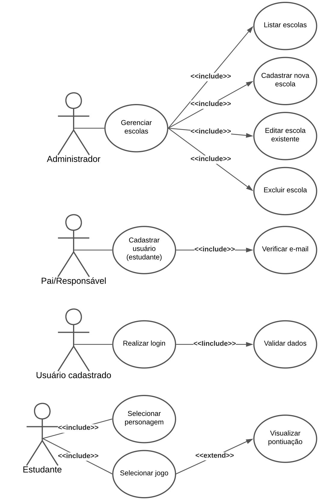
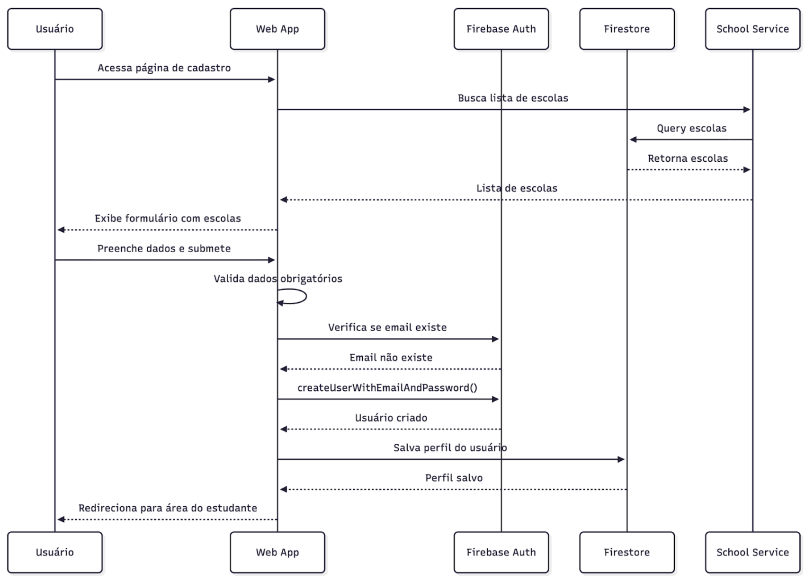
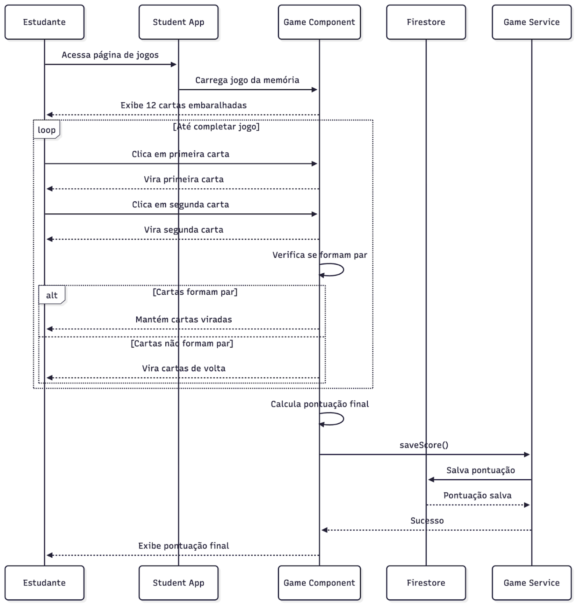
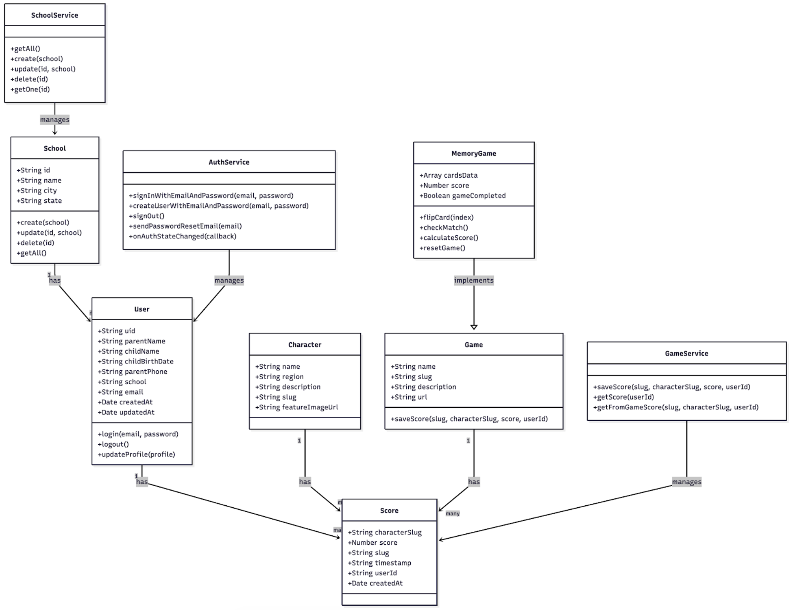

# Projeto Interdisciplinar I - 2ª Etapa – Projeto da Solução

**INSTITUTO FEDERAL DO PARANÁ – CAMPUS PINHAIS**

_Curso de Gestão da Tecnologia da Informação_

AVA MOREIRA DE LIMA | JOÃO LUIZ VICENTE JUNIOR

_Pinhais/2025_

> Projeto apresentado à disciplina de Projeto Interdisciplinar I, do curso de
> Gestão da Tecnologia da Informação, do Instituto Federal do Paraná Campus
> Pinhais, desenvolvido sob a orientação das professoras Eliana Maria dos Santos
> e Lauriana Paludo.

---

## INTRODUÇÃO

No Brasil existe uma grande diversidade cultural e étnico-racial, uma
característica muito forte para a nossa cultura. Por essa razão, a Lei nº
11.645/08 estabeleceu a obrigatoriedade do ensino da História e Cultura
Afro-Brasileira e Indígena no currículo escolar, reconhecendo a importância do
tema para a formação cidadã. Porém, a implementação desse conteúdo nas escolas
públicas enfrenta um desafio significativo: a dificuldade ao acesso de
ferramentas pedagógicas. Muitos educadores não têm materiais didáticos adequados
para abordar a complexidade das relações étnico-raciais e o combate ao
preconceito de forma lúdica e acessível para crianças.

Diante desta necessidade no processo de ensino-aprendizagem, o presente trabalho
propõe o desenvolvimento de "Etnos: Gamificando a Diversidade", uma plataforma
de jogos digitais educativos. Alinhada aos Objetivos de Desenvolvimento
Sustentável (ODS) 4 e 10, a proposta busca complementar o ensino formal,
utilizando a gamificação como estratégia para o desenvolvimento de empatia,
consciência cultural e justiça social. O jogo Etnos envolverá estudantes em uma
jornada interativa por diferentes culturas brasileiras, utilizando desafios como
quizzes, jogos da memória e atividades de correspondência. A meta é oferecer uma
solução tecnológica e pedagógica que combata ativamente os comportamentos
preconceituosos, promovendo o conhecimento das contribuições dos diversos povos
na construção da sociedade brasileira.

## 1. Lista de requisitos funcionais

### 1.1 Gestão de Usuários

| Código | Requisito Funcional                                                                                       |
| ------ | --------------------------------------------------------------------------------------------------------- |
| RF001  | O sistema deve permitir cadastro de usuários (pais/responsáveis) com informações pessoais e da criança    |
| RF002  | O sistema deve validar dados obrigatórios no cadastro (nome, email, senha, data de nascimento da criança) |
| RF003  | O sistema deve permitir login de usuários autenticados via email e senha                                  |
| RF004  | O sistema deve permitir recuperação de senha via email                                                    |
| RF005  | O sistema deve manter sessão do usuário logado                                                            |
| RF006  | O sistema deve permitir logout seguro do usuário                                                          |
| RF007  | O sistema deve validar se o email já existe antes do cadastro                                             |
| RF008  | O sistema deve armazenar perfil do usuário no Firebase Firestore                                          |

### 1.2 Gestão de Escolas

| Código | Requisito Funcional                                                  |
| ------ | -------------------------------------------------------------------- |
| RF009  | O sistema deve permitir cadastro de escolas no painel administrativo |
| RF010  | O sistema deve listar escolas disponíveis para seleção no cadastro   |
| RF011  | O sistema deve permitir edição de dados das escolas                  |
| RF012  | O sistema deve permitir exclusão de escolas                          |
| RF013  | O sistema deve armazenar dados das escolas (nome, cidade, estado)    |

### 1.3 Sistema de Personagens

| Código | Requisito Funcional                                                                        |
| ------ | ------------------------------------------------------------------------------------------ |
| RF014  | O sistema deve apresentar 5 personagens representando diferentes regiões do Brasil         |
| RF015  | O sistema deve permitir seleção de um personagem pelo estudante                            |
| RF016  | O sistema deve armazenar a seleção do personagem no localStorage                           |
| RF017  | O sistema deve exibir informações do personagem selecionado (nome, região, descrição)      |
| RF018  | O sistema deve validar se um personagem foi selecionado antes de permitir acesso aos jogos |

### 1.4 Sistema de Jogos da Memória

| Código | Requisito Funcional                                                         |
| ------ | --------------------------------------------------------------------------- |
| RF019  | O sistema deve oferecer jogo da memória com elementos culturais brasileiros |
| RF020  | O sistema deve apresentar 12 cartas com elementos da culturais              |
| RF021  | O sistema deve embaralhar as cartas aleatoriamente a cada partida           |
| RF022  | O sistema deve permitir virar duas cartas por vez                           |
| RF023  | O sistema deve verificar se as cartas viradas formam um par                 |
| RF024  | O sistema deve manter cartas viradas quando formam par                      |
| RF025  | O sistema deve virar cartas de volta quando não formam par                  |
| RF026  | O sistema deve calcular pontuação baseada no tempo e tentativas             |
| RF027  | O sistema deve salvar pontuação do jogador no Firebase                      |
| RF028  | O sistema deve exibir pontuação final ao completar o jogo                   |

### 1.5 Interface do Estudante

| Código | Requisito Funcional                                                                   |
| ------ | ------------------------------------------------------------------------------------- |
| RF029  | O sistema deve apresentar página inicial de boas-vindas para estudantes               |
| RF030  | O sistema deve permitir navegação entre seções (seleção de personagem, jogos, perfil) |
| RF031  | O sistema deve exibir breadcrumbs para navegação                                      |
| RF032  | O sistema deve proteger rotas que requerem autenticação                               |
| RF033  | O sistema deve redirecionar usuários não autenticados para login                      |

### 1.6 Interface Administrativa

| Código | Requisito Funcional                                                     |
| ------ | ----------------------------------------------------------------------- |
| RF034  | O sistema deve fornecer painel administrativo para gestão da plataforma |
| RF035  | O sistema deve permitir gerenciamento de usuários                       |
| RF036  | O sistema deve permitir monitoramento do progresso dos estudantes       |

### 1.7 Interface Pública

| Código | Requisito Funcional                                               |
| ------ | ----------------------------------------------------------------- |
| RF037  | O sistema deve apresentar página inicial com proposta educacional |
| RF038  | O sistema deve exibir personagem aleatório na página de login     |
| RF039  | O sistema deve apresentar informações sobre a plataforma          |
| RF040  | O sistema deve fornecer links para cadastro e login               |

## 2. Lista de Requisitos Não Funcionais

### 2.1 Performance

| Código | Requisito Não Funcional                                     |
| ------ | ----------------------------------------------------------- |
| RNF001 | O sistema deve carregar páginas em menos de 5 segundos      |
| RNF002 | O sistema deve suportar até 50 usuários simultâneos         |
| RNF003 | O sistema deve ter tempo de resposta de API menor que 600ms |
| RNF004 | O sistema deve otimizar carregamento de imagens e recursos  |

### 2.2 Usabilidade

| Código | Requisito Não Funcional                                                           |
| ------ | --------------------------------------------------------------------------------- |
| RNF005 | O sistema deve ser intuitivo para crianças de 10-12 anos                          |
| RNF006 | O sistema deve ter interface responsiva para desktop e mobile                     |
| RNF007 | O sistema deve usar cores e elementos visuais apropriados para o público infantil |
| RNF008 | O sistema deve fornecer feedback visual para ações do usuário                     |

### 2.3 Segurança

| Código | Requisito Não Funcional                                       |
| ------ | ------------------------------------------------------------- |
| RNF009 | O sistema deve criptografar senhas dos usuários               |
| RNF010 | O sistema deve validar dados de entrada para prevenir injeção |
| RNF011 | O sistema deve implementar autenticação segura via Firebase   |
| RNF012 | O sistema deve proteger rotas administrativas                 |
| RNF013 | O sistema deve validar permissões de acesso por usuário       |

### 2.4 Escalabilidade

| Código | Requisito Não Funcional                                        |
| ------ | -------------------------------------------------------------- |
| RNF014 | O sistema deve suportar crescimento de usuários sem degradação |
| RNF015 | O sistema deve usar arquitetura de microserviços (monorepo)    |
| RNF016 | O sistema deve permitir adição de novos jogos facilmente       |

### 2.6 Compatibilidade

| Código | Requisito Não Funcional                                                          |
| ------ | -------------------------------------------------------------------------------- |
| RNF017 | O sistema deve funcionar em navegadores modernos (Chrome, Firefox, Safari, Edge) |
| RNF018 | O sistema deve ser compatível com dispositivos móveis (iOS e Android)            |
| RNF019 | O sistema deve funcionar em diferentes resoluções de tela                        |
| RNF020 | O sistema deve suportar Node.js versão 20 ou superior                            |

### 2.7 manutenção

| Código | Requisito Não Funcional                                       |
| ------ | ------------------------------------------------------------- |
| RNF021 | O sistema deve usar TypeScript para verificação de tipos      |
| RNF022 | O sistema deve seguir padrões de código consistentes (ESLint) |
| RNF023 | O sistema deve ter documentação técnica atualizada            |
| RNF024 | O sistema deve permitir deploy independente de cada aplicação |

## 3. Especificação de casos de uso

### 3.1 UC001 - Cadastrar Usuário

> Ator Principal: Pai/Responsável

> Pré-condições: Usuário acessa a página de cadastro

#### Fluxo Principal:

1. Usuário acessa página de cadastro
1. Sistema exibe formulário de cadastro
1. Usuário preenche dados pessoais e da criança
1. Usuário seleciona escola da lista
1. Usuário define senha e confirma
1. Sistema valida dados obrigatórios
1. Sistema verifica se email já existe
1. Sistema cria conta no Firebase
1. Sistema salva perfil no Firestore
1. Sistema redireciona para área do estudante

#### Fluxos Alternativos:

- 1a. Dados obrigatórios não preenchidos: Sistema exibe mensagem de erro
- 2a. Escolha de escola não selecionada: Sistema exibe mensagem de erro
- 3a. Senha e confirmação não coincidem: Sistema exibe mensagem de erro
- 6a. Dados inválidos: Sistema exibe mensagem de erro
- 7a. Email já existe: Sistema exibe mensagem de erro
- 8a. Erro no cadastro: Sistema exibe mensagem de erro

### 3.2 UC002 - Realizar Login

> Ator Principal: Usuário cadastrado

> Pré-condições: Usuário possui conta válida

#### Fluxo Principal:

1. Usuário acessa página de login
1. Sistema exibe formulário de login
1. Usuário informa email e senha
1. Sistema valida credenciais
1. Sistema autentica usuário no Firebase
1. Sistema carrega perfil do usuário
1. Sistema redireciona para área do estudante

#### Fluxos Alternativos:

- 4a. Credenciais inválidas: Sistema exibe mensagem de erro
- 5a. Erro de autenticação: Sistema exibe mensagem de erro

### 3.3 UC003 - Selecionar Personagem

> Ator Principal: Estudante autenticado

> Pré-condições: Usuário está logado

#### Fluxo Principal:

1. Estudante acessa página de seleção de personagem
1. Sistema exibe 5 personagens disponíveis
1. Estudante visualiza informações de cada personagem
1. Estudante seleciona um personagem
1. Sistema armazena seleção no localStorage
1. Sistema habilita botão "Iniciar Jornada"
1. Estudante clica em "Iniciar Jornada"
1. Sistema redireciona para página de jogos

#### Fluxos Alternativos:

- 4a. Nenhum personagem selecionado: Botão permanece desabilitado

### 3.4 UC004 - Jogar Jogo da Memória

> Ator Principal: Estudante com personagem selecionado

> Pré-condições: Personagem foi selecionado

#### Fluxo Principal:

1. Estudante acessa página de jogos
1. Sistema exibe jogo da memória disponível
1. Estudante clica no jogo da memória
1. Sistema carrega 12 cartas embaralhadas
1. Estudante clica em duas cartas
1. Sistema verifica se formam par 7a. Se formam par: Sistema mantém cartas
   viradas 7b. Se não formam par: Sistema vira cartas de volta
1. Sistema repete passos 5-7 até completar jogo
1. Sistema calcula pontuação final
1. Sistema salva pontuação no Firebase
1. Sistema exibe pontuação final

#### Fluxos Alternativos:

- 6a. Cartas iguais: Sistema mantém cartas viradas e adiciona pontos
- 6b. Cartas diferentes: Sistema vira cartas após 1 segundo

### 3.5 UC005 - Gerenciar Escolas (Admin)

> Ator Principal: Administrador

> Pré-condições: Usuário tem permissões administrativas

#### Fluxo Principal:

1. Administrador acessa painel administrativo
1. Sistema exibe menu de gestão
1. Administrador seleciona "Gerenciar Escolas"
1. Sistema lista escolas cadastradas
1. Administrador pode:
1. Cadastrar nova escola
1. Editar escola existente
1. Excluir escola
1. Sistema valida dados da escola
1. Sistema salva alterações no Firestore

#### Fluxos Alternativos:

- 6a. Dados inválidos: Sistema exibe mensagem de erro
- 7a. Erro ao salvar: Sistema exibe mensagem de erro

## 4. Diagrama de sequência ou atividades

### 4.1 Sequência de Cadastro de Usuário

### 4.2 Sequência de Jogo da Memória

## 5. Diagrama de Classes

## 6. Testes

Esta seção descreve a estratégia de testes adotada para garantir a qualidade do
sistema.

### 6.1 Testes de Caixa-Preta (Black Box Testing)

Testes funcionais que avaliam o comportamento do sistema com base nas entradas e
saídas esperadas, sem considerar a lógica interna do código.

### 6.1.1 Testes de Interface de Usuário

Avaliam se as funcionalidades principais da interface estão operando
corretamente para o usuário final.

#### T001 - Teste de Cadastro de Usuário

| Item                   | Descrição                                                                                                  |
| ---------------------- | ---------------------------------------------------------------------------------------------------------- |
| Objetivo               | Verificar se o cadastro de usuário funciona corretamente                                                   |
| Pré-condições          | Acessar página de cadastro                                                                                 |
| Cenários de Teste      | Dados válidos,completos, Email já existente, Campos obrigatórios vazios, Senhas diferentes, Email inválido |
| Critérios de Aceitação | Usuário é cadastrado e redirecionado para área do estudante                                                |

#### T002 - Teste de Login

| Item                   | Descrição                                                             |
| ---------------------- | --------------------------------------------------------------------- |
| Objetivo               | Verificar se o login funciona corretamente                            |
| Pré-condições          | Usuário cadastrado no sistema                                         |
| Cenários de Teste      | Credenciais válida, Email inexistente, Senha incorreta, Campos vazios |
| Critérios de Aceitação | Usuário é autenticado e redirecionado para área do estudante          |

#### T003 - Teste de Seleção de Personagem

| Item                   | Descrição                                                        |
| ---------------------- | ---------------------------------------------------------------- |
| Objetivo               | Verificar se a seleção de personagem funciona corretamente       |
| Pré-condições          | Usuário logado                                                   |
| Cenários de Teste      | Seleção válida, Navegação sem seleção, Persistência após refresh |
| Critérios de Aceitação | Personagem é selecionado e armazenado corretamente               |

#### T004 - Teste do Jogo da Memória

| Item                   | Descrição                                                                                      |
| ---------------------- | ---------------------------------------------------------------------------------------------- |
| Objetivo               | Verificar se o jogo funciona corretamente                                                      |
| Pré-condições          | Personagem selecionado                                                                         |
| Cenários de Teste      | Jogo completo, Pares corretos, Pares incorretos, Cálculo de pontuação, Salvamento da pontuação |
| Critérios de Aceitação | Jogo funciona corretamente e pontuação é salva                                                 |

### 6.1.2 Testes de Navegação

Verificam a fluidez e consistência da navegação entre as páginas e
funcionalidades do sistema.

#### T005 - Teste de Fluxo Completo

| Item                   | Descrição                                                                                       |
| ---------------------- | ----------------------------------------------------------------------------------------------- |
| Objetivo               | Verificar fluxo completo do usuário                                                             |
| Cenários de Teste      | Cadastro → Seleção → Jogo, Login → Seleção → Jogo, Navegação entre páginas, Logout e novo login |
| Critérios de Aceitação | Fluxo completo funciona sem erros                                                               |

## 6.2 Testes de Aceitação

Testes realizados com usuários reais para validar se o sistema atende às
expectativas e necessidades do público-alvo.

### 6.2.1 Testes com Usuários Finais (Crianças)

Grupo de 20 crianças (10–12 anos), em 2 sessões de 30 minutos.

#### T006 - Usabilidade para Crianças

| Item                   | Descrição                                                                                                    |
| ---------------------- | ------------------------------------------------------------------------------------------------------------ |
| Objetivo               | Avaliar facilidade de uso para público infantil                                                              |
| Métricas               | Tempo para cadastro (≤ 5 min) , Tempo para seleção (≤ 2 min) , Tempo para jogo (≤ 10 min) , Taxa de abandono |
| Critérios de Aceitação | 90% das crianças completam o fluxo sem ajuda                                                                 |

#### T007 - Satisfação do Usuário

| Item                   | Descrição                                                                                                      |
| ---------------------- | -------------------------------------------------------------------------------------------------------------- |
| Objetivo               | Avaliar satisfação com a experiência                                                                           |
| Métricas               | Questionário (escala 1–5) , Preferência por personagens , Dificuldade percebida , Intenção de continuar usando |
| Critérios de Aceitação | Média de satisfação ≥ 3.5                                                                                      |

### 6.3 Testes de Performance

Avaliam a estabilidade e o desempenho do sistema sob diferentes cargas de uso.

#### T007 - Teste de Carga

| Item                   | Descrição                                            |
| ---------------------- | ---------------------------------------------------- |
| Objetivo               | Verificar comportamento sob carga                    |
| Cenários               | 10, 25 e 50 usuários simultâneos                     |
| Métricas               | Tempo de resposta, Uso de recursos                   |
| Critérios de Aceitação | Sistema mantém performance aceitável até 25 usuários |

### 6.4 Testes de Segurança

Testes que garantem a proteção contra acessos indevidos e entradas maliciosas.

#### T008 - Teste de Autenticação

| Item                   | Descrição                                                    |
| ---------------------- | ------------------------------------------------------------ |
| Objetivo               | Verificar segurança da autenticação                          |
| Cenários               | Login inválido, Acesso sem autenticação, Expiração de sessão |
| Métricas               | Tempo de resposta, Uso de recursos                           |
| Critérios de Aceitação | Sistema bloqueia acessos não autorizados                     |

### 6.5 Cronograma de Testes

| Fase                  | Duração   | Atividades                                   |
| --------------------- | --------- | -------------------------------------------- |
| Preparação            | 1 semana  | Configuração de ambiente                     |
| Testes de Caixa-Preta | 2 semanas | Execução de testes automatizados e manuais   |
| Testes de Aceitação   | 3 semanas | Testes com usuários finais                   |
| Testes de Performance | 1 semana  | Testes de carga                              |
| Testes de Segurança   | 1 semana  | Testes de vulnerabilidades                   |
| Análise e Relatório   | 1 semana  | Consolidação de resultados e relatório final |

### 6.6 Critérios de Aceite

O sistema será considerado aprovado quando:

- 95% dos testes de caixa-preta passarem
- 90% dos usuários finais conseguirem completar o fluxo principal
- 95% dos pais conseguirem realizar o cadastro
- 100% dos administradores conseguirem usar as ferramentas
- Nenhuma vulnerabilidade crítica de segurança

## 7. Cronograma

### 7.1 Configuração Inicial

| Tipo     | Tarefa                                                                    | Semanas |
| -------- | ------------------------------------------------------------------------- | ------- |
| DevOps   | Configuração inicial do monorepo e ambiente produtivo (Firebase e Vercel) | 1       |
| Frontend | Camada de autenticação e cadastro de usuários                             | 2       |
| Frontend | Setup inicial para interface com Tailwind                                 | 1       |
| Frontend | Desenvolvimento da biblioteca de UI (@etnos/ui) com componentes básicos   | 2       |

### 7.2 Jogo da Memória

| Tipo                 | Tarefa                                                                | Semanas |
| -------------------- | --------------------------------------------------------------------- | ------- |
| Pré-Análise          | Análise da lógica e regra de negócio do jogo                          | 1       |
| FrontEnd             | Desenvolvimento do jogo dentro da arquitetura de jogos (@etnos/games) | 2       |
| Testes e Homologação | Realização de testes de usabilidade e funcionalidade do jogo          | 1       |

### 7.3 Jogo "Adivinhe o Nome"

| Tipo                 | Tarefa                                                                | Semanas |
| -------------------- | --------------------------------------------------------------------- | ------- |
| Análise              | Análise da lógica e regra de negócio do jogo                          | 1       |
| FrontEnd             | Desenvolvimento do jogo dentro da arquitetura de jogos (@etnos/games) | 2       |
| Testes e Homologação | Realização de testes de usabilidade e funcionalidade do jogo          | 1       |

### 7.4 Painel Administrativo

| Tipo        | Tarefa                                                         | Semanas |
| ----------- | -------------------------------------------------------------- | ------- |
| Pré-Análise | Definição de requisitos do de usuário do admin app             | 0.5     |
| Backend     | Configuração e integração com Firebase Authentication          | 1       |
| Backend     | Implementação da lógica de autenticação no admin app           | 1       |
| Backend     | Criação das APIs para gerenciar usuários e conteúdo do jogo    | 4       |
| Frontend    | Desenvolvimento da interface e navegação do admin app          | 2       |
| Frontend    | Implementação das telas de gerenciamento de usuários e escolas | 1       |
| DevOps      | Configuração do deploy de um ambiente de produção              | 1       |
| Testes      | Testes de funcionalidade das features do admin                 | 1       |
