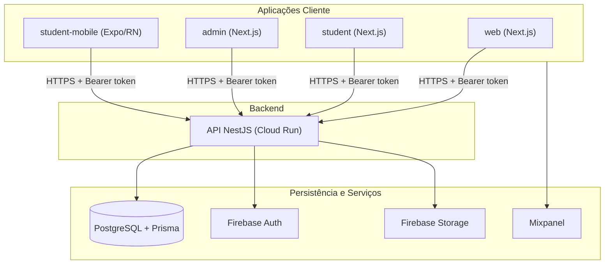

# Etnos: Gamificando a Diversidade

> **Relatório Final do Projeto Interdisciplinar II** — artigo técnico no modelo SBC adaptado (IFPR Pinhais).

**Ava Moreira de Lima, João Luiz Vicente Junior, Eliana Maria dos Santos, Lauriana Paludo**

Curso Superior de Tecnologia em Gestão da Tecnologia da Informação
Instituto Federal do Paraná (IFPR) – Campus Pinhais
Av. Humberto de Alencar Castelo Branco, 1575 – Pinhais – PR – Brasil

`{ava.lima, joao.vicente}@estudante.ifpr.edu.br` · `{eliana.santos, lauriana.paludo}@ifpr.edu.br`

---

## Resumo

As escolas públicas da região de Pinhais enfrentam dificuldade de acesso a ferramentas pedagógicas digitais para cumprir a obrigatoriedade do ensino da história e cultura afro-brasileira e indígena (Leis nº 10.639/03 e nº 11.645/08). Este artigo apresenta o desenvolvimento do **Etnos: Gamificando a Diversidade**, plataforma de jogos educativos voltada a estudantes do 5º ano do Ensino Fundamental, que utiliza gamificação para promover empatia e consciência cultural. O projeto foi concebido com modelagem UML (casos de uso, sequência, classes e pacotes) e gerido com Scrum em seis sprints quinzenais, monitoradas por métricas de fluxo (Response Time, Cycle Time, Lead Time e Throughput). A solução foi implementada como monorepo TypeScript com Next.js, React Native/Expo, NestJS, Prisma/PostgreSQL e Firebase, com publicação em Vercel e Google Cloud Run. Foram entregues 46 histórias ao longo do ciclo, com 100% do escopo principal concluído, testes de carga atendendo aos requisitos de desempenho (p95 < 600 ms) e validação com usuários reais. A ação extensionista capacitou a comunidade escolar parceira, contribuindo para a inclusão digital e para os ODS 4 (Educação de Qualidade) e 10 (Redução das Desigualdades).

**Palavras-chave:** Gestão de Projetos, Engenharia de Software, Curricularização da Extensão, Modelagem UML, Métricas de Fluxo, Gamificação, Educação Étnico-Racial.

---

## 1. Introdução

O Brasil é marcado por grande diversidade cultural e étnico-racial. Reconhecendo essa característica, o Artigo 26-A da LDB — alterado pelas Leis nº 10.639/03 e nº 11.645/08 — tornou obrigatório o ensino da História e Cultura Afro-Brasileira e Indígena em todo o currículo escolar. Contudo, no Arranjo Produtivo Local (APL) educacional da região de Pinhais, a implementação efetiva desse conteúdo esbarra em um problema concreto: muitas escolas públicas e seus educadores não dispõem de materiais didáticos adequados para abordar a complexidade das relações étnico-raciais e o combate ao preconceito de forma lúdica e acessível para crianças, e os processos de apoio pedagógico permanecem majoritariamente manuais e desconectados de ferramentas digitais.

Diante dessa lacuna identificada no pré-projeto, o Projeto Interdisciplinar II propôs o desenvolvimento do **Etnos: Gamificando a Diversidade**, uma plataforma de jogos digitais educativos destinada a estudantes do 5º ano do Ensino Fundamental (10–12 anos), com cadastro mediado por pais/responsáveis e gestão de conteúdo pelas escolas. A plataforma conduz o estudante em uma jornada interativa por diferentes culturas brasileiras por meio de personagens regionais e desafios como jogo da memória e jogo de adivinhação de palavras.

A justificativa do projeto ancora-se nos Objetivos de Desenvolvimento Sustentável (ODS) da Agenda 2030: o **ODS 4 (Educação de Qualidade)**, ao oferecer ferramenta tecnológica gratuita que complementa o ensino formal, e o **ODS 10 (Redução das Desigualdades)**, ao combater ativamente comportamentos preconceituosos e ampliar a representatividade dos diversos povos na construção da sociedade brasileira no ambiente digital educacional.

Este artigo está organizado da seguinte forma: a Seção 2 apresenta a fundamentação teórica; a Seção 3 detalha a metodologia, a modelagem UML e a infraestrutura; a Seção 4 descreve o desenvolvimento e a gestão das sprints; a Seção 5 analisa as métricas de fluxo e os resultados técnicos; a Seção 6 documenta a ação extensionista e seu impacto na comunidade; e a Seção 7 traz as conclusões e os trabalhos futuros.

## 2. Fundamentação Teórica

**Engenharia de Software e Modelagem UML.** O projeto adotou práticas consolidadas de Engenharia de Software [Sommerville 2019; Pressman e Maxim 2021]: levantamento e especificação de requisitos funcionais e não funcionais, modelagem com a Unified Modeling Language (UML) — diagramas estruturais (Classes e Pacotes) e comportamentais (Casos de Uso e Sequência) — e estratégia de testes em múltiplos níveis (caixa-preta, aceitação, performance e segurança).

**Governança e Gestão de TI.** A gestão do projeto seguiu princípios de governança de TI aplicados a pequenos times: rastreabilidade das decisões (cards, commits vinculados e comentários de homologação no ClickUp/GitHub), versionamento semântico automatizado e qualidade contínua (CI/CD, análise estática com SonarCloud).

**Framework Ágil — Scrum.** A execução utilizou o framework Scrum [Schwaber e Sutherland 2020], com **sprints quinzenais**, **reuniões diárias (Dailys)** para sincronização e remoção de impedimentos, backlog priorizado e **Definição de Pronto (DoD)** acordada antes da codificação de cada história.

**Métricas de Fluxo.** Para análise quantitativa da entrega, foram acompanhadas as métricas de fluxo do método Kanban [Anderson 2010]: **Response Time** (tempo entre criação do card e início da execução), **Cycle Time** (tempo entre início da execução e homologação), **Lead Time** (tempo total de ponta a ponta) e **Throughput** (vazão de itens entregues por sprint).

**Inclusão Digital e Extensão Universitária.** Como projeto de curricularização da extensão (Resolução CNE/CES nº 7/2018), o Etnos articula ensino, pesquisa e extensão ao levar tecnologia educacional gratuita à comunidade escolar. A fundamentação pedagógica apoia-se na **BNCC** — Competência Geral 5 (cultura digital crítica e ética) e Competência Geral 9 (empatia, cooperação e valorização da diversidade) — e na **Resolução CNE/CP nº 01/2004**, que institui as Diretrizes Curriculares Nacionais para a Educação das Relações Étnico-Raciais. A gamificação é empregada como estratégia de engajamento e desenvolvimento de habilidades cognitivas e socioemocionais, conforme detalhado na [Fundamentação Pedagógica](fundamentacao.md).

## 3. Metodologia e Especificação da Modelagem

### 3.1 Mapeamento de Requisitos

Os requisitos foram extraídos no formato tradicional a partir do problema identificado no pré-projeto, organizados em **32 requisitos funcionais** (RF001–RF032) agrupados por domínio — gestão de usuários, gestão de escolas, sistema de personagens, jogos, interface do estudante, interface administrativa e interface pública — e **24 requisitos não funcionais** (RNF001–RNF024) cobrindo performance, usabilidade, segurança, escalabilidade, compatibilidade e manutenibilidade. Durante as sprints, os requisitos foram desdobrados em histórias de usuário e casos de uso (UC001–UC009) com critérios de aceite explícitos. A especificação completa está documentada em [Projeto Interdisciplinar — Especificação](projeto-interdisciplinar-02.md).

Exemplos representativos:

| Código | Requisito                                                                   |
| ------ | --------------------------------------------------------------------------- |
| RF001  | O sistema deve permitir cadastro de usuários (pais/responsáveis)            |
| RF008  | O sistema deve permitir seleção de um personagem                            |
| RF019  | O sistema deve oferecer jogo da memória com elementos culturais brasileiros |
| RF026  | O sistema deve fornecer painel administrativo para gestão da plataforma     |
| RNF002 | O sistema deve suportar até 50 usuários simultâneos                         |
| RNF003 | O sistema deve ter tempo de resposta de API menor que 600 ms                |
| RNF005 | O sistema deve ser intuitivo para crianças de 10–12 anos                    |

### 3.2 Modelagem UML Empregada

A arquitetura estática foi desenhada com **diagrama de Classes** (entidades de domínio: usuário, escola, personagem, jogo, pontuação e histórico) e organização em **Pacotes**, que se materializou diretamente na estrutura do monorepo (apps e packages com responsabilidades isoladas). O comportamento dinâmico foi especificado com **diagramas de Caso de Uso** (UC001 – Cadastrar Usuário, UC002 – Realizar Login, UC003 – Selecionar Personagem, UC004 – Jogar Jogo da Memória, UC005 – Gerenciar Escolas, entre outros) e **diagramas de Sequência** para os fluxos de cadastro e do jogo da memória.


Essa modelagem garantiu a **Definição de Pronto (DoD)** antes da codificação: cada história só entrava em desenvolvimento com fluxo principal, fluxos alternativos e critérios de aceite especificados, o que reduziu ambiguidades na homologação.

### 3.3 Infraestrutura e Ambientes

| Ambiente                 | Descrição                                                                                                                                                                                                                                                                                        |
| ------------------------ | ------------------------------------------------------------------------------------------------------------------------------------------------------------------------------------------------------------------------------------------------------------------------------------------------ |
| **Desenvolvimento**      | Monorepo local com Turborepo e Yarn Workspaces; apps em portas dedicadas (web `:3000`, admin `:3001`, estudante `:3002`, API NestJS `:8080`); PostgreSQL local; emulação do app mobile via Expo; Storybook (`:6006`) para o design system.                                                       |
| **Homologação/Produção** | Frontends Next.js na **Vercel** (rewrites multi-app via `vercel.json`); API NestJS containerizada (Docker multi-stage) no **Google Cloud Run** (`api.etnos.online`); **PostgreSQL gerenciado (Supabase)** com PgBouncer; **Firebase** (Auth e Storage); documentação MkDocs no **GitHub Pages**. |
| **Qualidade contínua**   | GitHub Actions (testes, type-check, build), SonarCloud (análise estática), Chromatic (regressão visual do Storybook) e semantic-release (versionamento automático).                                                                                                                              |

## 4. Desenvolvimento e Execução

### 4.1 Stack Tecnológica

A implementação foi realizada integralmente em **TypeScript**, organizada como monorepo com 7 aplicações e 9 pacotes compartilhados:

- **Frontend web:** Next.js 16 + React 19, Tailwind CSS 4 e Ant Design (apps `web` — site institucional e cadastro —, `student` — portal do estudante — e `admin` — painel administrativo);
- **Mobile:** React Native com Expo e Expo Router (app `student-mobile`, iOS/Android), com notificações push via Expo Notifications;
- **Backend:** API REST em NestJS 10 com documentação OpenAPI/Swagger, ORM **Prisma 6** sobre **PostgreSQL** (17 modelos de dados: usuários, escolas, personagens, conteúdos de jogos, pontuações, histórico, NPS, mídia e notificações);
- **Autenticação:** arquitetura híbrida **Firebase Auth** (identidade, tokens) + perfil de negócio no PostgreSQL, com papéis `student`, `admin`, `school` e `teacher` e guards de autorização por rota;
- **Jogos:** biblioteca React própria (`@etnos/games`) com o **Jogo da Memória** e o **Adivinhe a Palavra**, configuráveis por personagem cultural e por escola;
- **Analytics:** **Mixpanel** (web e mobile) via pacote compartilhado `@etnos/analytics`, rastreando a jornada do estudante (cadastro, seleção de personagem, partidas, recuperação de senha);
- **Observabilidade:** Sentry (erros), métricas Prometheus na API e testes de carga com k6.

A arquitetura geral de comunicação é ilustrada a seguir:



Detalhes completos em [Arquitetura do Monorepo](monorepo-architecture.md), [Autenticação](auth-architecture.md), [Arquitetura dos Jogos](games-architecture.md) e [Modelagem de Dados](data-model.md).

### 4.2 Gestão do Fluxo de Trabalho (Sprints)

O desenvolvimento foi coordenado em **seis sprints quinzenais** (02/03/2026 a 24/05/2026), com backlog e quadro de fluxo no ClickUp e commits vinculados aos cards. As **Dailys** foram o principal instrumento de tomada de decisão: nelas a equipe alinhou consensos técnicos como a migração da persistência de Firestore para PostgreSQL/Prisma (Sprint 2), o modelo de pontuação com bônus progressivo do jogo da memória (Sprint 3), a estratégia de deploy isolado do painel admin (Sprint 4) e a adoção de PgBouncer/cache após incidente de limite de conexões em testes com alunos (Sprint 6).

| Sprint | Período     | Foco principal                                                                                                                   | Entregas |
| ------ | ----------- | -------------------------------------------------------------------------------------------------------------------------------- | -------- |
| 1      | 02/03–15/03 | Base do MVP: landing page, cadastro, login, proteção de rotas, responsividade                                                    | 5        |
| 2      | 16/03–29/03 | Jogo da Memória temático, recuperação de senha, seleção de personagem, página 404, migração para PostgreSQL/Prisma               | 7        |
| 3      | 30/03–12/04 | Níveis de dificuldade, pontuação com bônus, avatares, histórico de jogos, observabilidade (Sentry), segurança                    | 11       |
| 4      | 13/04–26/04 | Painel admin (estrutura base, CRUD de escolas, deploy isolado), revisão de conteúdo do Adivinhe                                  | 4        |
| 5      | 27/04–10/05 | App nativo (Expo), gestão de usuários, notificações push, cadastro via link da escola, onboarding                                | 9        |
| 6      | 11/05–24/05 | Dashboard de progresso, Mixpanel, performance (PgBouncer, cache), qualidade (SonarCloud), homologação geral e documentação final | 10       |

Os relatórios detalhados de cada sprint estão em [Sprint 1](planejamento-sprint-1.md) a [Sprint 6](planejamento-sprint-6.md).

## 5. Análise de Desempenho e Resultados Técnicos

### 5.1 Métricas de Fluxo

Os dados consolidados da execução, extraídos do quadro de fluxo (criação, movimentações e fechamento dos cards), estão detalhados no [Relatório de Desempenho](relatorio-interdisciplinar-2026.md). Valores médios de referência (Sprint 1, base de calibração do fluxo):

| Métrica           | Valor médio         | Leitura                                                                                                                            |
| ----------------- | ------------------- | ---------------------------------------------------------------------------------------------------------------------------------- |
| **Response Time** | ~12,2 dias corridos | Elevado por incluir fila pré-sprint: cards criados em 25/02 com execução iniciada perto do meio da sprint.                         |
| **Cycle Time**    | ~3,6 dias corridos  | Boa eficiência de desenvolvimento; o maior ciclo individual foi a história UC009 (~11,5 dias), que atravessou quase toda a sprint. |
| **Lead Time**     | ~16 dias corridos   | Tempo total de ponta a ponta, também impactado pela espera pré-execução.                                                           |
| **Throughput**    | 5 histórias/sprint  | 100% do backlog principal da sprint entregue.                                                                                      |

A evolução do **Throughput** ao longo do ciclo demonstra ganho de maturidade da equipe e estabilização da capacidade de entrega:

```text
Sprint 1  █████        5 entregas
Sprint 2  ███████      7 entregas
Sprint 3  ███████████  11 entregas
Sprint 4  ████         4 entregas (escopo maior por item: fundação do admin)
Sprint 5  █████████    9 entregas
Sprint 6  ██████████   10 entregas
Total: 46 entregas | Média: ~7,7 entregas/sprint
```

Com foco na **Sprint 4 e no encerramento**: a Sprint 4 fechou 100% do escopo com **antecedência de 3 dias** em relação ao prazo final (todas as entregas formalizadas em 23/04), com três dos quatro cards concluídos entre 2 e 9 dias antes do vencimento individual — indicando Cycle Time em queda em relação ao início do projeto. O único desvio (revisão de conteúdo do jogo Adivinhe, +5 dias sobre o vencimento interno) decorreu de limite de geração de imagens na ferramenta de IA utilizada, sem impacto no prazo da sprint. As Sprints 5 e 6 mantiveram o padrão: 9 e 10 entregas respectivamente, sem pendências abertas no encerramento do ciclo.

### 5.2 Planejado vs. Realizado

**Escopo:** das 46 histórias planejadas nas seis sprints, **46 foram entregues (100%)**, sem itens cancelados. Os desvios foram pontuais e rastreáveis:

- **UC009** (Sprint 1): fechada 7 dias após o vencimento interno do card, ainda dentro da sprint;
- **RF025** (Sprint 1): retrabalho de homologação na rota `/jogos` gerou o desdobramento da página 404 como novo card, entregue na Sprint 2 — exemplo de gestão explícita de débito identificado em teste;
- **Sprint 3**: 7 dos 11 cards fecharam após o vencimento interno, mas a sprint foi concluída com antecedência ao prazo final, evidenciando concentração de homologação no fim do ciclo como principal gargalo de fluxo;
- **Sprint 6**: incidente real de limite de conexões do PostgreSQL durante testes simultâneos com alunos foi convertido em entrega técnica (PgBouncer, Prisma singleton, cache e revisão do React Query).

**Horas de Esforço vs. Valor Gerado:** não houve apontamento sistemático de horas no ClickUp, o que impede o cálculo formal da relação horas/throughput — registrado como limitação de processo. Total de horas da equipe: **[PREENCHER: total de horas estimado/apontado pela equipe]**. Em contrapartida, o valor gerado é mensurável pelo produto: plataforma completa em produção ([etnos.online](https://etnos.online)), com dois jogos, painel administrativo, app mobile e dashboard pedagógico operacionais.

**Desempenho não funcional (RNF002/RNF003):** os testes de carga com k6 (documentados em [Testes de Performance](performance-tests.md)) validaram os requisitos com folga em ambiente de referência: no cenário `public-schools` com pico de **100 usuários virtuais** (o dobro do exigido pelo RNF002), o p95 de latência ficou em **9 ms** (limite: 600 ms) com **0% de erros** em 9.456 requisições; no cenário `characters` (perfil standard, 75 VUs), o p95 da listagem ficou em **7,4 ms**, evidenciando a efetividade do cache em memória do catálogo.

### 5.3 Demonstração Audiovisual e Jornada do Usuário

Para fins de validação e auditoria da solução desenvolvida, um vídeo demonstrativo do Produto Mínimo Viável (MVP) foi gravado e disponibilizado publicamente. O registro audiovisual apresenta a execução física do sistema em ambiente de homologação, simulando a jornada completa do usuário do **Etnos** desde o fluxo de autenticação — cadastro do responsável, login e vínculo com a escola — passando pela seleção do guia cultural, pelas partidas do Jogo da Memória e do Adivinhe a Palavra, até a geração dos relatórios de impacto no dashboard administrativo (pontuação média por escola, ranking de alunos e histórico de atividades). O vídeo completo possui duração de **[PREENCHER: X minutos]** e pode ser acessado publicamente através do seguinte endereço eletrônico: **[PREENCHER: link público do vídeo — YouTube não listado ou Google Drive com acesso "qualquer pessoa com o link"]**, também referenciado na seção de Referências deste artigo [LIMA; VICENTE JUNIOR, 2026].

## 6. Ação Extensionista e Impacto na Comunidade

### 6.1 A Oficina de Capacitação

**[PREENCHER: relato da oficina — data, local (escola parceira do APL de Pinhais), público participante (professores, gestores, responsáveis ou estudantes) e número de participantes.]** A oficina foi estruturada com metodologia ativa de **Product Discovery e Prototipagem**: os participantes percorreram a jornada do estudante na plataforma, validaram a adequação dos personagens e dos conteúdos culturais ao componente curricular do 5º ano e contribuíram com a priorização de melhorias — a exemplo da revisão pedagógica do conteúdo do jogo Adivinhe a Palavra realizada na Sprint 4, que ajustou palavras, dicas e correspondência imagem-palavra ao contexto cultural e ao público infantil.

### 6.2 Testes e Avaliação com Usuários Reais

A estratégia de testes de aceitação previu sessões com **grupo de 20 crianças (10–12 anos), em 2 sessões de 30 minutos**, com critérios objetivos: 90% das crianças completando o fluxo sem ajuda, cadastro em até 5 minutos, seleção de personagem em até 2 minutos e satisfação média ≥ 3,5 (escala 1–5).

Os testes em ambiente real com alunos produziram resultados diretos sobre o produto:

- **Performance sob uso concorrente:** os testes simultâneos com alunos na Sprint 6 expuseram o limite de conexões do PostgreSQL, corrigido com PgBouncer, cache e otimização de queries — a comunidade testando o sistema melhorou diretamente sua robustez;
- **Usabilidade:** ajustes de UX e compatibilidade cross-browser (Chrome, Firefox, Safari e Edge) e revisão de responsividade mobile foram realizados a partir das observações de uso;
- **Feedback estruturado:** a plataforma incorpora coleta de **NPS pós-jogo** (modal ao final de cada partida), permitindo acompanhamento contínuo da satisfação dos estudantes;
- **[PREENCHER: resultados quantitativos das sessões com usuários — taxa de conclusão do fluxo, tempos medidos, nota média de satisfação e principais feedbacks qualitativos.]**

O resultado em inclusão digital é tangível: o cadastro simplificado via link da escola e o onboarding pós-login reduziram o atrito de entrada para famílias com menor familiaridade digital, e o app nativo ampliou o acesso a estudantes que dependem de dispositivos móveis.

### 6.3 Sustentabilidade da Solução

A continuidade da operação pelo parceiro local foi tratada como requisito de projeto:

- **Custo de operação próximo de zero:** a infraestrutura é serverless/gerenciada em camadas gratuitas ou de baixo custo (Vercel, Google Cloud Run com escala a zero, Firebase, Supabase);
- **Autonomia de gestão:** o painel administrativo permite que a própria escola gerencie usuários, habilite jogos e personagens, edite conteúdos dos jogos e acompanhe o desempenho dos alunos sem depender de desenvolvedores;
- **Operação assistida por automação:** deploys automatizados via GitHub Actions (API) e Vercel (frontends), versionamento semântico e monitoramento de erros com Sentry;
- **Transferência de conhecimento:** documentação técnica completa e pública ([joaojuniorbr.github.io/etnos](https://joaojuniorbr.github.io/etnos/)) cobrindo arquitetura, deploy, modelo de dados e manuais de operação, além do código aberto no GitHub ([github.com/joaojuniorbr/etnos](https://github.com/joaojuniorbr/etnos)).

## 7. Conclusão

A transição entre o ambiente controlado de desenvolvimento e a realidade do ecossistema escolar foi a principal fonte de aprendizado da equipe. Tecnicamente, o incidente de conexões de banco durante os testes com alunos demonstrou que requisitos não funcionais validados em laboratório precisam ser revalidados sob uso real e concorrente. Em gestão, as métricas de fluxo revelaram que o gargalo do time não era capacidade de produção, mas **concentração de homologação no fim das sprints** — corrigida progressivamente com registros objetivos de QA, distribuição das validações ao longo do ciclo e formalização de desvios, o que se refletiu na entrega antecipada das Sprints 4 a 6.

O projeto gerou contribuições em três dimensões: **acadêmica**, ao integrar de forma prática Engenharia de Software (UML, requisitos, testes), Gestão de Projetos (Scrum, métricas de fluxo) e extensão curricularizada; **profissional**, ao expor a equipe a um ciclo completo de produto — da modelagem ao deploy em produção com CI/CD, observabilidade e analytics; e **social**, ao entregar ao município de Pinhais uma ferramenta gratuita e operante que apoia escolas públicas no cumprimento das Leis nº 10.639/03 e nº 11.645/08, promovendo educação étnico-racial lúdica e inclusão digital, em alinhamento aos ODS 4 e 10.

Como trabalhos futuros, sugere-se: (i) ampliação do catálogo de jogos (quizzes e atividades de correspondência previstos na concepção original); (ii) relatórios pedagógicos avançados para professores, com indicadores de aprendizagem por habilidade da BNCC; (iii) publicação do app nativo nas lojas oficiais (App Store e Google Play); (iv) estudo longitudinal do impacto pedagógico da plataforma sobre atitudes étnico-raciais dos estudantes, em parceria com as escolas; e (v) suporte a acessibilidade ampliada (leitores de tela e Libras), aprofundando o compromisso com a inclusão.
